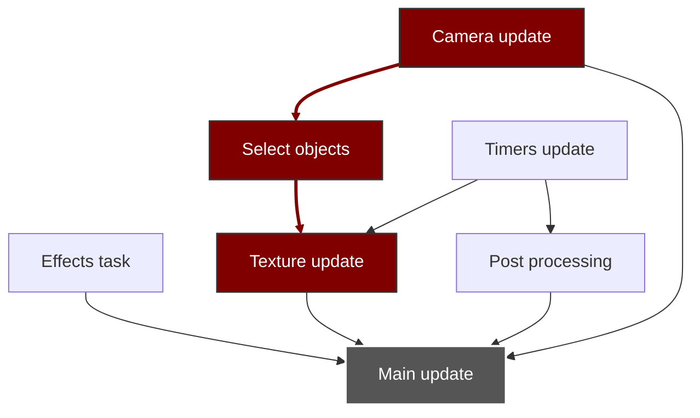

# Contexte

Corruption mémoire liée au fait que la tâche "Post Process" de DrawableDemo s'exécute deux fois, ce qui ne devrait pas être possible car Update bloquant.

Hash commit: 56efc4437dd6f43dea5dc288f61a5f335ac90c0b

## Analyse avec TTD. Première approche: remonter le temps jusqu'à retrouver l'état invalide

Point d'arrêt avant soumission tâches

```text
0:000> .for (r $t0=0; @$t0 < 7; r $t0=@$t0+1) { dx SceneDemo->UpdateTasks->m_Tasks[@$t0] }
SceneDemo->UpdateTasks->m_Tasks[@$t0]                  [Type: MegaEngine::Win32::MegaTaskPool::MegaTask]
    [+0x000] Description      : "Camera update" [Type: std::basic_string<char,std::char_traits<char>,std::allocator<char> >]
    [+0x028] Children         : { size=16 } [Type: std::array<MegaEngine::Win32::MegaTaskPool::MegaTask *,16>]
    [+0x0a8] WorkJob          : {...} [Type: std::function<void __cdecl(void)>]
    [+0x100] DependencyCount  : 0x0 [Type: std::atomic<unsigned int>]
    [+0x140] ChildCount       : 0x2 [Type: std::atomic<unsigned int>]
    [+0x144] InitialDependencyCount : 0x0 [Type: unsigned int]
    [+0x180] Done             : true [Type: std::atomic<bool>] -------------------------------------------------------------------------------> Quand on quitte Run
    [+0x1c0] RunningCount     : 0x0 [Type: std::atomic<unsigned int>]
SceneDemo->UpdateTasks->m_Tasks[@$t0]                  [Type: MegaEngine::Win32::MegaTaskPool::MegaTask]
    [+0x000] Description      : "Select objects" [Type: std::basic_string<char,std::char_traits<char>,std::allocator<char> >]
    [+0x028] Children         : { size=16 } [Type: std::array<MegaEngine::Win32::MegaTaskPool::MegaTask *,16>]
    [+0x0a8] WorkJob          : {...} [Type: std::function<void __cdecl(void)>]
    [+0x100] DependencyCount  : 0x0 [Type: std::atomic<unsigned int>]
    [+0x140] ChildCount       : 0x1 [Type: std::atomic<unsigned int>]
    [+0x144] InitialDependencyCount : 0x1 [Type: unsigned int]
    [+0x180] Done             : false [Type: std::atomic<bool>]
    [+0x1c0] RunningCount     : 0x1 [Type: std::atomic<unsigned int>] ------------------------------------------------------------------------> La tâche dépends de Camera Update donc c'est normal quelle démarre
SceneDemo->UpdateTasks->m_Tasks[@$t0]                  [Type: MegaEngine::Win32::MegaTaskPool::MegaTask]
    [+0x000] Description      : "Timers update" [Type: std::basic_string<char,std::char_traits<char>,std::allocator<char> >]
    [+0x028] Children         : { size=16 } [Type: std::array<MegaEngine::Win32::MegaTaskPool::MegaTask *,16>]
    [+0x0a8] WorkJob          : {...} [Type: std::function<void __cdecl(void)>]
    [+0x100] DependencyCount  : 0x0 [Type: std::atomic<unsigned int>]
    [+0x140] ChildCount       : 0x2 [Type: std::atomic<unsigned int>]
    [+0x144] InitialDependencyCount : 0x0 [Type: unsigned int]
    [+0x180] Done             : false [Type: std::atomic<bool>]
    [+0x1c0] RunningCount     : 0x0 [Type: std::atomic<unsigned int>]
SceneDemo->UpdateTasks->m_Tasks[@$t0]                  [Type: MegaEngine::Win32::MegaTaskPool::MegaTask]
    [+0x000] Description      : "Effects task" [Type: std::basic_string<char,std::char_traits<char>,std::allocator<char> >]
    [+0x028] Children         : { size=16 } [Type: std::array<MegaEngine::Win32::MegaTaskPool::MegaTask *,16>]
    [+0x0a8] WorkJob          : {...} [Type: std::function<void __cdecl(void)>]
    [+0x100] DependencyCount  : 0x0 [Type: std::atomic<unsigned int>]
    [+0x140] ChildCount       : 0x1 [Type: std::atomic<unsigned int>]
    [+0x144] InitialDependencyCount : 0x0 [Type: unsigned int]
    [+0x180] Done             : false [Type: std::atomic<bool>]
    [+0x1c0] RunningCount     : 0x0 [Type: std::atomic<unsigned int>]
SceneDemo->UpdateTasks->m_Tasks[@$t0]                  [Type: MegaEngine::Win32::MegaTaskPool::MegaTask]
    [+0x000] Description      : "Post processing" [Type: std::basic_string<char,std::char_traits<char>,std::allocator<char> >]
    [+0x028] Children         : { size=16 } [Type: std::array<MegaEngine::Win32::MegaTaskPool::MegaTask *,16>]
    [+0x0a8] WorkJob          : {...} [Type: std::function<void __cdecl(void)>]
    [+0x100] DependencyCount  : 0x1 [Type: std::atomic<unsigned int>]
    [+0x140] ChildCount       : 0x1 [Type: std::atomic<unsigned int>]
    [+0x144] InitialDependencyCount : 0x1 [Type: unsigned int]
    [+0x180] Done             : false [Type: std::atomic<bool>]
    [+0x1c0] RunningCount     : 0x0 [Type: std::atomic<unsigned int>]
SceneDemo->UpdateTasks->m_Tasks[@$t0]                  [Type: MegaEngine::Win32::MegaTaskPool::MegaTask]
    [+0x000] Description      : "Texture update" [Type: std::basic_string<char,std::char_traits<char>,std::allocator<char> >]
    [+0x028] Children         : { size=16 } [Type: std::array<MegaEngine::Win32::MegaTaskPool::MegaTask *,16>]
    [+0x0a8] WorkJob          : {...} [Type: std::function<void __cdecl(void)>]
    [+0x100] DependencyCount  : 0x2 [Type: std::atomic<unsigned int>]
    [+0x140] ChildCount       : 0x1 [Type: std::atomic<unsigned int>]
    [+0x144] InitialDependencyCount : 0x2 [Type: unsigned int]
    [+0x180] Done             : false [Type: std::atomic<bool>]
    [+0x1c0] RunningCount     : 0x0 [Type: std::atomic<unsigned int>]
SceneDemo->UpdateTasks->m_Tasks[@$t0]                  [Type: MegaEngine::Win32::MegaTaskPool::MegaTask]
    [+0x000] Description      : "Main update" [Type: std::basic_string<char,std::char_traits<char>,std::allocator<char> >]
    [+0x028] Children         : { size=16 } [Type: std::array<MegaEngine::Win32::MegaTaskPool::MegaTask *,16>]
    [+0x0a8] WorkJob          : {...} [Type: std::function<void __cdecl(void)>]
    [+0x100] DependencyCount  : 0x3 [Type: std::atomic<unsigned int>]
    [+0x140] ChildCount       : 0x0 [Type: std::atomic<unsigned int>]
    [+0x144] InitialDependencyCount : 0x4 [Type: unsigned int]
    [+0x180] Done             : false [Type: std::atomic<bool>]
    [+0x1c0] RunningCount     : 0x0 [Type: std::atomic<unsigned int>]
	
```

Par contre au début de Run vaut m_ActiveTaskCount == -1... ce qui n'est pas normal.

Ceci fait que le WaitAll rend la main prématurément, ce qui conduit à la corruption mémoire

Du coup: point d'arrêt pour remonter le temps au moment où la valeur était encore cohérente

```text
bp /w "SceneDemo->ThreadPool->m_ActiveTaskCount._Storage._Value != -1" @$ip
```

<ins>Time Travel Position</ins>: 11322D:A0 -> dernière fois où SceneDemo->ThreadPool->m_ActiveTaskCount est cohérent au début de l'update dans ma session de debug.

Etonnant: au début de l'éxecution de SceneUpdate, la tâche "Main update" n'est pas à l'état "Done", alors que c'est le cas pour les autres:

```text
0:000> .for (r $t0=0; @$t0 < 7; r $t0=@$t0+1) { dx SceneDemo->UpdateTasks->m_Tasks[@$t0].Done }
SceneDemo->UpdateTasks->m_Tasks[@$t0].Done                  : true [Type: std::atomic<bool>]
    [<Raw View>]     [Type: std::atomic<bool>]
    [value]          : true [Type: bool]
SceneDemo->UpdateTasks->m_Tasks[@$t0].Done                  : true [Type: std::atomic<bool>]
    [<Raw View>]     [Type: std::atomic<bool>]
    [value]          : true [Type: bool]
SceneDemo->UpdateTasks->m_Tasks[@$t0].Done                  : true [Type: std::atomic<bool>]
    [<Raw View>]     [Type: std::atomic<bool>]
    [value]          : true [Type: bool]
SceneDemo->UpdateTasks->m_Tasks[@$t0].Done                  : true [Type: std::atomic<bool>]
    [<Raw View>]     [Type: std::atomic<bool>]
    [value]          : true [Type: bool]
SceneDemo->UpdateTasks->m_Tasks[@$t0].Done                  : true [Type: std::atomic<bool>]
    [<Raw View>]     [Type: std::atomic<bool>]
    [value]          : true [Type: bool]
SceneDemo->UpdateTasks->m_Tasks[@$t0].Done                  : true [Type: std::atomic<bool>]
    [<Raw View>]     [Type: std::atomic<bool>]
    [value]          : true [Type: bool]
SceneDemo->UpdateTasks->m_Tasks[@$t0].Done                  : false [Type: std::atomic<bool>]
    [<Raw View>]     [Type: std::atomic<bool>]
    [value]          : false [Type: bool]
```

Après vérification: c'était le cas à l'update précédent

<ins>Time Travel Position</ins>: 112EA9:9E : update précédent, avec état des tâches cohérent. Ici, SceneDemo->ThreadPool->m_ActiveTaskCount vaut -1 :cry:

## Seconde approche: partir de zero, et trouver le premier point dans le temps où SceneDemo->ThreadPool->m_ActiveTaskCount est négatif

```text
bp /w "SceneDemo->ThreadPool->m_ActiveTaskCount._Storage._Value == -1" 00007ff7`dc3f3f50
```

<ins>Time Travel Position</ins>: FDC51:9E -> Dernière execution dont l'état initial était cohérent, qui a déclenché le :poop:

<ins>Time Travel Position</ins>: FEA9E:9E -> Première execution à partir de laquelle le compte de tâche n'est pas ok

Point d'arrêt matériel sur mise à jour de m_ActiveTaskCount:

-> Au début de run la valeur est bien 7
-> Ensuite, le thread principale continue à queue les tasks, puis on est arrêté dans un worker:

```text
 # Child-SP          RetAddr               Call Site
00 00000048`477ff280 00007ff7`dc439d79     MegaEngineLibWin32AppTest!std::_Atomic_integral<int,4>::fetch_add+0x4b [C:\Program Files\Microsoft Visual Studio\18\Community\VC\Tools\MSVC\14.50.35717\include\atomic @ 1419] 
01 00000048`477ff3a0 00007ff7`dc431bb1     MegaEngineLibWin32AppTest!std::_Atomic_integral_facade<int>::fetch_sub+0x49 [C:\Program Files\Microsoft Visual Studio\18\Community\VC\Tools\MSVC\14.50.35717\include\atomic @ 1640] 
02 00000048`477ff4a0 00007ff7`dc433218     MegaEngineLibWin32AppTest!MegaEngine::Win32::MegaThreadPool::ExecuteTask+0x3d1 [C:\dev\Codeberg\MegaProject\Shared\MegaEngine\Win32\MegaThreadPool.h @ 470] 
03 00000048`477ff630 00007ff7`dc430ac7     MegaEngineLibWin32AppTest!MegaEngine::Win32::MegaThreadPool::WorkerRoutine+0x1b8 [C:\dev\Codeberg\MegaProject\Shared\MegaEngine\Win32\MegaThreadPool.h @ 509] 
04 00000048`477ff800 00007ff7`dc42779c     MegaEngineLibWin32AppTest!`MegaEngine::Win32::MegaThreadPool::MegaThreadPool'::`4'::<lambda_1>::operator()+0x47 [C:\dev\Codeberg\MegaProject\Shared\MegaEngine\Win32\MegaThreadPool.h @ 202] 
05 00000048`477ff910 00007ff7`dc41baf7     MegaEngineLibWin32AppTest!std::invoke<`MegaEngine::Win32::MegaThreadPool::MegaThreadPool'::`4'::<lambda_1> >+0x2c [C:\Program Files\Microsoft Visual Studio\18\Community\VC\Tools\MSVC\14.50.35717\include\type_traits @ 1678] 
06 00000048`477ffa10 00007ff8`1a752ec5     MegaEngineLibWin32AppTest!std::thread::_Invoke<std::tuple<`MegaEngine::Win32::MegaThreadPool::MegaThreadPool'::`4'::<lambda_1> >,0>+0x87 [C:\Program Files\Microsoft Visual Studio\18\Community\VC\Tools\MSVC\14.50.35717\include\thread @ 60] 
07 00000048`477ffb70 00007ff9`1578e8d7     ucrtbased!thread_start<unsigned int (__cdecl*)(void *),1>+0xa5 [minkernel\crts\ucrt\src\appcrt\startup\thread.cpp @ 97] 
08 00000048`477ffbd0 00007ff9`1664c48c     KERNEL32!BaseThreadInitThunk+0x17
09 00000048`477ffc00 00000000`00000000     ntdll!RtlUserThreadStart+0x2c
0:010> .frame 2
02 00000048`477ff4a0 00007ff7`dc433218     MegaEngineLibWin32AppTest!MegaEngine::Win32::MegaThreadPool::ExecuteTask+0x3d1 [C:\dev\Codeberg\MegaProject\Shared\MegaEngine\Win32\MegaThreadPool.h @ 470] 
0:010> dx Task
Task                 : 0x21cd17cafc0 [Type: MegaEngine::Win32::MegaTaskPool::MegaTask *]
    [+0x000] Description      : "Texture update" [Type: std::basic_string<char,std::char_traits<char>,std::allocator<char> >]
    [+0x028] Children         : { size=16 } [Type: std::array<MegaEngine::Win32::MegaTaskPool::MegaTask *,16>]
    [+0x0a8] WorkJob          : {...} [Type: std::function<void __cdecl(void)>]
    [+0x100] DependencyCount  : 0x2 [Type: std::atomic<unsigned int>]
    [+0x140] ChildCount       : 0x1 [Type: std::atomic<unsigned int>]
    [+0x144] InitialDependencyCount : 0x2 [Type: unsigned int]
    [+0x180] Done             : true [Type: std::atomic<bool>]
    [+0x1c0] RunningCount     : 0x0 [Type: std::atomic<unsigned int>]
0:010> ~.
. 10  Id: 3f28.4b50 Suspend: 4096 Teb: 00000048`46b71000 Unfrozen
```

Graph de dépendance des tâches (généré par Gemini!):



> [!Important]
> Texture update ne devrait pas être la première tâche étant donné que ses dépendances ne sont pas satisfaites...

En résumé:

| Tâche|Active count (après execution)|Commentaire
|--------------|-----------------|----|
|Texture update|6|FDCBA:D
|Timers update|5|
|Effect task|4|
|Camera update|3|
|Post processing|2|
|Main update|1|
|Select objects|0|FEA46:26
|Texture update|-1|FEA6F:D (⚠️ Problème ⚠️\)

Au moment où "Select Object" se termine, "Texture Update" est une seconde fois dans une queue (index 2).

```text
0:011> p
Time Travel Position: FEA26:21B
MegaEngineLibWin32AppTest!MegaEngine::Utilities::MegaStealingDequeue<MegaEngine::Win32::MegaTaskPool::MegaTask *>::Steal+0x4f:
00007ff7`dc43204f 488b8560010000  mov     rax,qword ptr [rbp+160h] ss:00000048`478ff1b0=0000021cc6000c00

0:011> k
 # Child-SP          RetAddr               Call Site
00 00000048`478ff020 00007ff7`dc432f3d     MegaEngineLibWin32AppTest!MegaEngine::Utilities::MegaStealingDequeue<MegaEngine::Win32::MegaTaskPool::MegaTask *>::Steal+0x4f [C:\dev\Codeberg\MegaProject\Shared\MegaEngine\Utilities\MegaStealingDequeue.h @ 227] 
01 00000048`478ff1b0 00007ff7`dc4331df     MegaEngineLibWin32AppTest!MegaEngine::Win32::MegaThreadPool::TryGetNextTask+0x1bd [C:\dev\Codeberg\MegaProject\Shared\MegaEngine\Win32\MegaThreadPool.h @ 399] 
02 00000048`478ff380 00007ff7`dc430ac7     MegaEngineLibWin32AppTest!MegaEngine::Win32::MegaThreadPool::WorkerRoutine+0x17f [C:\dev\Codeberg\MegaProject\Shared\MegaEngine\Win32\MegaThreadPool.h @ 506] 
03 00000048`478ff550 00007ff7`dc42779c     MegaEngineLibWin32AppTest!`MegaEngine::Win32::MegaThreadPool::MegaThreadPool'::`4'::<lambda_1>::operator()+0x47 [C:\dev\Codeberg\MegaProject\Shared\MegaEngine\Win32\MegaThreadPool.h @ 202] 
04 00000048`478ff660 00007ff7`dc41baf7     MegaEngineLibWin32AppTest!std::invoke<`MegaEngine::Win32::MegaThreadPool::MegaThreadPool'::`4'::<lambda_1> >+0x2c [C:\Program Files\Microsoft Visual Studio\18\Community\VC\Tools\MSVC\14.50.35717\include\type_traits @ 1678] 
05 00000048`478ff760 00007ff8`1a752ec5     MegaEngineLibWin32AppTest!std::thread::_Invoke<std::tuple<`MegaEngine::Win32::MegaThreadPool::MegaThreadPool'::`4'::<lambda_1> >,0>+0x87 [C:\Program Files\Microsoft Visual Studio\18\Community\VC\Tools\MSVC\14.50.35717\include\thread @ 60] 
06 00000048`478ff8c0 00007ff9`1578e8d7     ucrtbased!thread_start<unsigned int (__cdecl*)(void *),1>+0xa5 [minkernel\crts\ucrt\src\appcrt\startup\thread.cpp @ 97] 
07 00000048`478ff920 00007ff9`1664c48c     KERNEL32!BaseThreadInitThunk+0x17
08 00000048`478ff950 00000000`00000000     ntdll!RtlUserThreadStart+0x2c

0:011> dx this
this                 : 0x21cc6000c00 [Type: MegaEngine::Utilities::MegaStealingDequeue<MegaEngine::Win32::MegaTaskPool::MegaTask *> *]
    [+0x000] m_Top            : 30 [Type: std::atomic<__int64>]
    [+0x040] m_Bottom         : 30 [Type: std::atomic<__int64>]
    [+0x080] m_Buffer         : {...} [Type: std::atomic<MegaEngine::Utilities::MegaStealingDequeue<MegaEngine::Win32::MegaTaskPool::MegaTask *>::CircularBuffer<MegaEngine::Win32::MegaTaskPool::MegaTask *> *>]
    [+0x088] m_Garbage        : { size=0x0 } [Type: std::vector<std::unique_ptr<MegaEngine::Utilities::MegaStealingDequeue<MegaEngine::Win32::MegaTaskPool::MegaTask *>::CircularBuffer<MegaEngine::Win32::MegaTaskPool::MegaTask *>,std::default_delete<MegaEngine::Utilities::MegaStealingDequeue<MegaEngine::Win32::MegaTaskPool::MegaTask *>::CircularBuffer<MegaEngine::Win32::MegaTaskPool::MegaTask *> > >,std::allocator<std::unique_ptr<MegaEngine::Utilities::MegaStealingDequeue<MegaEngine::Win32::MegaTaskPool::MegaTask *>::CircularBuffer<MegaEngine::Win32::MegaTaskPool::MegaTask *>,std::default_delete<MegaEngine::Utilities::MegaStealingDequeue<MegaEngine::Win32::MegaTaskPool::MegaTask *>::CircularBuffer<MegaEngine::Win32::MegaTaskPool::MegaTask *> > > > >]

```

## Comment la tâche en trop est-elle ajoutée?

FDC51:9E est la TTP pour lequel la dernière execution semble cohérente.

```text
0:010> !tt FDC51:9E
Setting position: FDC51:9E
(3f28.622c): Break instruction exception - code 80000003 (first/second chance not available)
Time Travel Position: FDC51:9E
MegaEngineLibWin32AppTest!SceneUpdate+0x30:
00007ff7`dc3f3f50 488b4508        mov     rax,qword ptr [rbp+8] ss:00000048`46cff2c8=0000021ccaa91510

0:000> dx SceneDemo->ThreadPool->m_ActiveTaskCount
SceneDemo->ThreadPool->m_ActiveTaskCount                 : 0 [Type: std::atomic<int>]
    [<Raw View>]     [Type: std::atomic<int>]
    [value]          : 0 [Type: int]

0:000> .for (r $t0=0; @$t0 < 7; r $t0=@$t0+1) { dx SceneDemo->UpdateTasks->m_Tasks[@$t0].Done }
SceneDemo->UpdateTasks->m_Tasks[@$t0].Done                  : true [Type: std::atomic<bool>]
    [<Raw View>]     [Type: std::atomic<bool>]
    [value]          : true [Type: bool]
SceneDemo->UpdateTasks->m_Tasks[@$t0].Done                  : true [Type: std::atomic<bool>]
    [<Raw View>]     [Type: std::atomic<bool>]
    [value]          : true [Type: bool]
SceneDemo->UpdateTasks->m_Tasks[@$t0].Done                  : true [Type: std::atomic<bool>]
    [<Raw View>]     [Type: std::atomic<bool>]
    [value]          : true [Type: bool]
SceneDemo->UpdateTasks->m_Tasks[@$t0].Done                  : true [Type: std::atomic<bool>]
    [<Raw View>]     [Type: std::atomic<bool>]
    [value]          : true [Type: bool]
SceneDemo->UpdateTasks->m_Tasks[@$t0].Done                  : true [Type: std::atomic<bool>]
    [<Raw View>]     [Type: std::atomic<bool>]
    [value]          : true [Type: bool]
SceneDemo->UpdateTasks->m_Tasks[@$t0].Done                  : false [Type: std::atomic<bool>] -------------------> Pas bon
    [<Raw View>]     [Type: std::atomic<bool>]
    [value]          : false [Type: bool]
SceneDemo->UpdateTasks->m_Tasks[@$t0].Done                  : true [Type: std::atomic<bool>]
    [<Raw View>]     [Type: std::atomic<bool>]
    [value]          : true [Type: bool]

```

J'étais passé à coté du fait qu'une tâche n'était pas terminé lors du run de SceneUpdate...

```text
0:000> ~10s
MegaEngineLibWin32AppTest!std::_Atomic_integral<unsigned int,4>::fetch_add+0x47:
00007ff7`dc3d2197 f00fc108        lock xadd dword ptr [rax],ecx ds:0000021c`d17cb2c0=00000000
0:010> k
 # Child-SP          RetAddr               Call Site
00 00000048`477ff280 00007ff7`dc439de9     MegaEngineLibWin32AppTest!std::_Atomic_integral<unsigned int,4>::fetch_add+0x47 [C:\Program Files\Microsoft Visual Studio\18\Community\VC\Tools\MSVC\14.50.35717\include\atomic @ 1419] 
01 00000048`477ff3a0 00007ff7`dc431a08     MegaEngineLibWin32AppTest!std::_Atomic_integral_facade<unsigned int>::fetch_sub+0x49 [C:\Program Files\Microsoft Visual Studio\18\Community\VC\Tools\MSVC\14.50.35717\include\atomic @ 1640] 
02 00000048`477ff4a0 00007ff7`dc433218     MegaEngineLibWin32AppTest!MegaEngine::Win32::MegaThreadPool::ExecuteTask+0x228 [C:\dev\Codeberg\MegaProject\Shared\MegaEngine\Win32\MegaThreadPool.h @ 434] 
03 00000048`477ff630 00007ff7`dc430ac7     MegaEngineLibWin32AppTest!MegaEngine::Win32::MegaThreadPool::WorkerRoutine+0x1b8 [C:\dev\Codeberg\MegaProject\Shared\MegaEngine\Win32\MegaThreadPool.h @ 509] 
04 00000048`477ff800 00007ff7`dc42779c     MegaEngineLibWin32AppTest!`MegaEngine::Win32::MegaThreadPool::MegaThreadPool'::`4'::<lambda_1>::operator()+0x47 [C:\dev\Codeberg\MegaProject\Shared\MegaEngine\Win32\MegaThreadPool.h @ 202] 
05 00000048`477ff910 00007ff7`dc41baf7     MegaEngineLibWin32AppTest!std::invoke<`MegaEngine::Win32::MegaThreadPool::MegaThreadPool'::`4'::<lambda_1> >+0x2c [C:\Program Files\Microsoft Visual Studio\18\Community\VC\Tools\MSVC\14.50.35717\include\type_traits @ 1678] 
06 00000048`477ffa10 00007ff8`1a752ec5     MegaEngineLibWin32AppTest!std::thread::_Invoke<std::tuple<`MegaEngine::Win32::MegaThreadPool::MegaThreadPool'::`4'::<lambda_1> >,0>+0x87 [C:\Program Files\Microsoft Visual Studio\18\Community\VC\Tools\MSVC\14.50.35717\include\thread @ 60] 
07 00000048`477ffb70 00007ff9`1578e8d7     ucrtbased!thread_start<unsigned int (__cdecl*)(void *),1>+0xa5 [minkernel\crts\ucrt\src\appcrt\startup\thread.cpp @ 97] 
08 00000048`477ffbd0 00007ff9`1664c48c     KERNEL32!BaseThreadInitThunk+0x17
09 00000048`477ffc00 00000000`00000000     ntdll!RtlUserThreadStart+0x2c
0:010> .frame 2
02 00000048`477ff4a0 00007ff7`dc433218     MegaEngineLibWin32AppTest!MegaEngine::Win32::MegaThreadPool::ExecuteTask+0x228 [C:\dev\Codeberg\MegaProject\Shared\MegaEngine\Win32\MegaThreadPool.h @ 434] 
0:010> dx Task
Task                 : 0x21cd17cafc0 [Type: MegaEngine::Win32::MegaTaskPool::MegaTask *]
    [+0x000] Description      : "Texture update" [Type: std::basic_string<char,std::char_traits<char>,std::allocator<char> >]
    [+0x028] Children         : { size=16 } [Type: std::array<MegaEngine::Win32::MegaTaskPool::MegaTask *,16>]
    [+0x0a8] WorkJob          : {...} [Type: std::function<void __cdecl(void)>]
    [+0x100] DependencyCount  : 0x0 [Type: std::atomic<unsigned int>]
    [+0x140] ChildCount       : 0x1 [Type: std::atomic<unsigned int>]
    [+0x144] InitialDependencyCount : 0x2 [Type: unsigned int]
    [+0x180] Done             : false [Type: std::atomic<bool>]
    [+0x1c0] RunningCount     : 0x1 [Type: std::atomic<unsigned int>]
```

Du coup: point d'arrêt sur update précédent:

```text
0:010> !tt FDC51:9E
Setting position: FDC51:9E
(3f28.622c): Break instruction exception - code 80000003 (first/second chance not available)
Time Travel Position: FDC51:9E
MegaEngineLibWin32AppTest!SceneUpdate+0x30:
00007ff7`dc3f3f50 488b4508        mov     rax,qword ptr [rbp+8] ss:00000048`46cff2c8=0000021ccaa91510
0:000> bp @rip "dx SceneDemo->ThreadPool->m_ActiveTaskCount; .for (r $t0=0; @$t0 < 7; r $t0=@$t0+1) { dx SceneDemo->UpdateTasks->m_Tasks[@$t0].Done }"
breakpoint 0 redefined
0:000> g-
SceneDemo->ThreadPool->m_ActiveTaskCount                 : 0 [Type: std::atomic<int>]
    [<Raw View>]     [Type: std::atomic<int>]
    [value]          : 0 [Type: int]
SceneDemo->UpdateTasks->m_Tasks[@$t0].Done                  : true [Type: std::atomic<bool>]
    [<Raw View>]     [Type: std::atomic<bool>]
    [value]          : true [Type: bool]
SceneDemo->UpdateTasks->m_Tasks[@$t0].Done                  : true [Type: std::atomic<bool>]
    [<Raw View>]     [Type: std::atomic<bool>]
    [value]          : true [Type: bool]
SceneDemo->UpdateTasks->m_Tasks[@$t0].Done                  : true [Type: std::atomic<bool>]
    [<Raw View>]     [Type: std::atomic<bool>]
    [value]          : true [Type: bool]
SceneDemo->UpdateTasks->m_Tasks[@$t0].Done                  : true [Type: std::atomic<bool>]
    [<Raw View>]     [Type: std::atomic<bool>]
    [value]          : true [Type: bool]
SceneDemo->UpdateTasks->m_Tasks[@$t0].Done                  : true [Type: std::atomic<bool>]
    [<Raw View>]     [Type: std::atomic<bool>]
    [value]          : true [Type: bool]
SceneDemo->UpdateTasks->m_Tasks[@$t0].Done                  : true [Type: std::atomic<bool>]
    [<Raw View>]     [Type: std::atomic<bool>]
    [value]          : true [Type: bool]
SceneDemo->UpdateTasks->m_Tasks[@$t0].Done                  : true [Type: std::atomic<bool>]
    [<Raw View>]     [Type: std::atomic<bool>]
    [value]          : true [Type: bool]
Time Travel Position: FD900:9E
MegaEngineLibWin32AppTest!SceneUpdate+0x30:
00007ff7`dc3f3f50 488b4508        mov     rax,qword ptr [rbp+8] ss:00000048`46cff2c8=0000021ccaa91510
```

La ttp FD900:9E semble être le bon point de départ:

* Active task count est zero
* Toutes les tâches sont done
* Tous les workers sont en train de steal/pop

Time Travel Position: FDBF4:1 -> moment où la tâche "Select Object" passe le running count à zero (thread 8)

Time Travel Position: FDBFC:8 -> dans le même temps, "Texture update" est executé (thread 10)

```text
0:010> p
Time Travel Position: FDBFC:8
MegaEngineLibWin32AppTest!MegaEngine::Win32::MegaThreadPool::ExecuteTask+0x107:
00007ff7`dc4318e7 85c0            test    eax,eax
0:010> dx Task
Task                 : 0x21cd17cafc0 [Type: MegaEngine::Win32::MegaTaskPool::MegaTask *]
    [+0x000] Description      : "Texture update" [Type: std::basic_string<char,std::char_traits<char>,std::allocator<char> >]
    [+0x028] Children         : { size=16 } [Type: std::array<MegaEngine::Win32::MegaTaskPool::MegaTask *,16>]
    [+0x0a8] WorkJob          : {...} [Type: std::function<void __cdecl(void)>]
    [+0x100] DependencyCount  : 0x0 [Type: std::atomic<unsigned int>]
    [+0x140] ChildCount       : 0x1 [Type: std::atomic<unsigned int>]
    [+0x144] InitialDependencyCount : 0x2 [Type: unsigned int]
    [+0x180] Done             : false [Type: std::atomic<bool>]
    [+0x1c0] RunningCount     : 0x0 [Type: std::atomic<unsigned int>]
0:010> dx this
this                 : 0x21cc5fad700 [Type: MegaEngine::Win32::MegaThreadPool *]
    [+0x000] m_Workers        : { size=0x8 } [Type: std::vector<std::jthread,std::allocator<std::jthread> >]
    [+0x020] m_PerThreadDequeues : unique_ptr {...} [Type: std::unique_ptr<MegaEngine::Utilities::MegaStealingDequeue<MegaEngine::Win32::MegaTaskPool::MegaTask *> [0],std::default_delete<MegaEngine::Utilities::MegaStealingDequeue<MegaEngine::Win32::MegaTaskPool::MegaTask *> [0]> >]
    [+0x028] m_WorkersCount   : 0x8 [Type: unsigned int]
    [+0x040] m_ShouldStop     : false [Type: std::atomic<bool>]
    [+0x080] m_FenceId        : 0x12f [Type: std::atomic<unsigned __int64>]
    [+0x0c0] m_ActiveTaskCount : 1 [Type: std::atomic<int>]

0:010> p
Time Travel Position: FDCB6:AA
MegaEngineLibWin32AppTest!MegaEngine::Win32::MegaThreadPool::ExecuteTask+0x339:
00007ff7`dc431b19 488b8568010000  mov     rax,qword ptr [rbp+168h] ss:00000048`477ff638=0000021cd17cafc0
0:010> dx -r1 ((MegaEngineLibWin32AppTest!MegaEngine::Win32::MegaTaskPool::MegaTask *)0x21cd17cb1c0)
((MegaEngineLibWin32AppTest!MegaEngine::Win32::MegaTaskPool::MegaTask *)0x21cd17cb1c0)                 : 0x21cd17cb1c0 [Type: MegaEngine::Win32::MegaTaskPool::MegaTask *]
    [+0x000] Description      : "Main update" [Type: std::basic_string<char,std::char_traits<char>,std::allocator<char> >]
    [+0x028] Children         : { size=16 } [Type: std::array<MegaEngine::Win32::MegaTaskPool::MegaTask *,16>]
    [+0x0a8] WorkJob          : {...} [Type: std::function<void __cdecl(void)>]
    [+0x100] DependencyCount  : 0x3 [Type: std::atomic<unsigned int>]
    [+0x140] ChildCount       : 0x0 [Type: std::atomic<unsigned int>]
    [+0x144] InitialDependencyCount : 0x4 [Type: unsigned int]
    [+0x180] Done             : false [Type: std::atomic<bool>]
    [+0x1c0] RunningCount     : 0x0 [Type: std::atomic<unsigned int>]
```

a FDCB6:AA (en gros, après boucle sur les enfants pour ajouter les items dans la file) on voit que la tâche "Main update" a encore 3 dépendances, alors qu'à ce point là, tout devrait être terminé

Quand on regard le main thread à ce moment:

```text
0:010> ~0 k
 # Child-SP          RetAddr               Call Site
00 00000048`46cfefc0 00007ff7`dc3d095b     MegaEngineLibWin32AppTest!std::_Atomic_integral<unsigned __int64,8>::fetch_add+0x49 [C:\Program Files\Microsoft Visual Studio\18\Community\VC\Tools\MSVC\14.50.35717\include\atomic @ 1531] 
01 00000048`46cff0e0 00007ff7`dc3f3fa0     MegaEngineLibWin32AppTest!MegaEngine::Win32::MegaThreadPool::Run+0x2bb [C:\dev\Codeberg\MegaProject\Shared\MegaEngine\Win32\MegaThreadPool.h @ 294] 
02 00000048`46cff2a0 00007ff7`dc44dcc6     MegaEngineLibWin32AppTest!SceneUpdate+0x80 [C:\dev\Codeberg\MegaProject\Tests\MegaEngineLibWin32AppTest\DrawableDemo.cpp @ 522] 
03 00000048`46cff3d0 00007ff7`dc3d00e4     MegaEngineLibWin32AppTest!MegaEngine::Application::MegaEngineApplicationBase::UpdateScene+0x1c6 [C:\dev\Codeberg\MegaProject\Sources\MegaEngine\Application\MegaApplicationBase.cpp @ 187] 
04 00000048`46cff500 00007ff7`dc3d04db     MegaEngineLibWin32AppTest!MegaEngine::Win32::MegaEngineAppRunner<MegaEngineSceneApplicationDemo>::RenderScene+0x84 [C:\dev\Codeberg\MegaProject\Shared\MegaEngine\Win32\MegaEngineApp.h @ 481] 
05 00000048`46cff660 00007ff7`dc3ce551     MegaEngineLibWin32AppTest!MegaEngine::Win32::MegaEngineAppRunner<MegaEngineSceneApplicationDemo>::Run+0x2bb [C:\dev\Codeberg\MegaProject\Shared\MegaEngine\Win32\MegaEngineApp.h @ 251] 
06 00000048`46cffb50 00007ff7`dc401f11     MegaEngineLibWin32AppTest!BasicSceneTest+0x91 [C:\dev\Codeberg\MegaProject\Tests\MegaEngineLibWin32AppTest\BasicSceneTest.cpp @ 42] 
07 00000048`46cffd20 00007ff7`dc6d1f42     MegaEngineLibWin32AppTest!wWinMain+0x41 [C:\dev\Codeberg\MegaProject\Tests\MegaEngineLibWin32AppTest\main.cpp @ 17] 
08 00000048`46cffe20 00007ff7`dc6d1df2     MegaEngineLibWin32AppTest!invoke_main+0x32 [D:\a\_work\1\s\src\vctools\crt\vcstartup\src\startup\exe_common.inl @ 123] 
09 00000048`46cffe60 00007ff7`dc6d1cae     MegaEngineLibWin32AppTest!__scrt_common_main_seh+0x132 [D:\a\_work\1\s\src\vctools\crt\vcstartup\src\startup\exe_common.inl @ 288] 
0a 00000048`46cffed0 00007ff7`dc6d1fde     MegaEngineLibWin32AppTest!__scrt_common_main+0xe [D:\a\_work\1\s\src\vctools\crt\vcstartup\src\startup\exe_common.inl @ 331] 
0b 00000048`46cfff00 00007ff9`1578e8d7     MegaEngineLibWin32AppTest!wWinMainCRTStartup+0xe [D:\a\_work\1\s\src\vctools\crt\vcstartup\src\startup\exe_wwinmain.cpp @ 17] 
0c 00000048`46cfff30 00007ff9`1664c48c     KERNEL32!BaseThreadInitThunk+0x17
0d 00000048`46cfff60 00000000`00000000     ntdll!RtlUserThreadStart+0x2c
```

On est de nouveau dans un Run, ce qui signifie que quelque chose a fait sortir le thread principale du wait

## Que se passe-t-il dans le main?

Depuis FDBFC:8, switch sur le main thread, et point d'arrêt lorsqu'on sort de l'attente

```
0:000> p
Time Travel Position: FDC26:271
MegaEngineLibWin32AppTest!MegaEngine::Win32::MegaThreadPool::WaitAll+0x2ea:
00007ff7`dc5fe1ca 488b85e0020000  mov     rax,qword ptr [rbp+2E0h] ss:00000048`46cff070=0000021cc5fad700
0:000> dx m_ActiveTaskCount
m_ActiveTaskCount                 : 0 [Type: std::atomic<int>] ------------------------> On s'apprête à sortir
    [<Raw View>]     [Type: std::atomic<int>]
    [value]          : 0 [Type: int]
```

```cpp
while (m_ActiveTaskCount.load(std::memory_order_acquire) > 0)
{
    auto TaskToRun = TryGetNextTask();
    if (TaskToRun.has_value())
    {
        ExecuteTask(TaskToRun.value());
        continue;
    }

    BOOL ShouldContinue = FALSE;

    for (UINT CurrentSpin = 0; CurrentSpin < MAX_SPIN_COUNT; CurrentSpin++)
    {
        TaskToRun = TryGetNextTask();
        if (TaskToRun.has_value())
        {
            ExecuteTask(TaskToRun.value());
            ShouldContinue = TRUE;
            break;
        }

        if (m_ActiveTaskCount.load(std::memory_order_acquire) <= 0)
        {
            ShouldContinue = TRUE; // --------> On tombe ici
            break;
        }

        _mm_pause();
    }

    if (ShouldContinue)
        continue;

    std::this_thread::yield();
}

return TRUE;
```

La question est ici: qui a passé cette valeur à zero?

```text
0:000> dx m_ActiveTaskCount
m_ActiveTaskCount                 : 0 [Type: std::atomic<int>]
    [<Raw View>]     [Type: std::atomic<int>]
    [value]          : 0 [Type: int]
0:000> dx &m_ActiveTaskCount._Storage._Value
&m_ActiveTaskCount._Storage._Value                 : 0x21cc5fad7c0 : 0 [Type: int *]
    0 [Type: int]
0:000> !tt FDBFC:8
Setting position: FDBFC:8
(3f28.4b50): Break instruction exception - code 80000003 (first/second chance not available)
Time Travel Position: FDBFC:8
MegaEngineLibWin32AppTest!MegaEngine::Win32::MegaThreadPool::ExecuteTask+0x107:
00007ff7`dc4318e7 85c0            test    eax,eax
0:010> bl
     0 d Enable Clear  00007ff7`dc3f3f50  [C:\dev\Codeberg\MegaProject\Tests\MegaEngineLibWin32AppTest\DrawableDemo.cpp @ 520]     0001 (0001)  0:**** MegaEngineLibWin32AppTest!SceneUpdate+0x30 "dx SceneDemo->ThreadPool->m_ActiveTaskCount; .for (r $t0=0; @$t0 < 7; r $t0=@$t0+1) { dx SceneDemo->UpdateTasks->m_Tasks[@$t0].Done }"
     1 d Enable Clear  0000021c`d17ca980 w 4 0001 (0001)  0:**** 
0:010> ba w 4 0x21cc5fad7c0
0:010> dd 0x21cc5fad7c0
0000021c`c5fad7c0  00000001 00000000 00000000 00000000
0000021c`c5fad7d0  00000000 00000000 00000000 00000000
0000021c`c5fad7e0  00000000 00000000 00000000 00000000
0000021c`c5fad7f0  00000000 00000000 00000000 00000000
0000021c`c5fad800  cdcdcdcd cdcdcdcd cdcdcdcd cdcdcdcd
0000021c`c5fad810  cdcdcdcd cdcdcdcd cdcdcdcd fdcdcdcd
0000021c`c5fad820  13fdfdfd 00007ff9 2b90dd0a 00007621
0000021c`c5fad830  c5faf220 0000021c c5fb21c0 0000021c
0:010> p
Time Travel Position: FDBFC:A
MegaEngineLibWin32AppTest!MegaEngine::Win32::MegaThreadPool::ExecuteTask+0x10c:
00007ff7`dc4318ec 488b8568010000  mov     rax,qword ptr [rbp+168h] ss:00000048`477ff638=0000021cd17cafc0
0:010> p
Time Travel Position: FDBFC:71
MegaEngineLibWin32AppTest!MegaEngine::Win32::MegaThreadPool::ExecuteTask+0x128:
00007ff7`dc431908 488b8568010000  mov     rax,qword ptr [rbp+168h] ss:00000048`477ff638=0000021cd17cafc0
0:010> p
Time Travel Position: FDBFC:764
MegaEngineLibWin32AppTest!MegaEngine::Win32::MegaThreadPool::ExecuteTask+0x13e:
00007ff7`dc43191e 488b8560010000  mov     rax,qword ptr [rbp+160h] ss:00000048`477ff630=0000021cc5fad700
0:010> p
Time Travel Position: FDBFC:797
MegaEngineLibWin32AppTest!MegaEngine::Win32::MegaThreadPool::ExecuteTask+0x1a7:
00007ff7`dc431987 c7452400000000  mov     dword ptr [rbp+24h],0 ss:00000048`477ff4f4=cccccccc
0:010> p
Time Travel Position: FDBFC:831
MegaEngineLibWin32AppTest!MegaEngine::Win32::MegaThreadPool::ExecuteTask+0x1d6:
00007ff7`dc4319b6 488b8568010000  mov     rax,qword ptr [rbp+168h] ss:00000048`477ff638=0000021cd17cafc0
0:010> p
Time Travel Position: FDBFC:85A
MegaEngineLibWin32AppTest!MegaEngine::Win32::MegaThreadPool::ExecuteTask+0x200:
00007ff7`dc4319e0 488b4548        mov     rax,qword ptr [rbp+48h] ss:00000048`477ff518=0000021cd17cb1c0
0:010> p
Breakpoint 2 hit
Time Travel Position: FDBFF:1
MegaEngineLibWin32AppTest!std::_Atomic_integral<int,4>::fetch_add+0x4b:
00007ff7`dc3d211b 8bc1            mov     eax,ecx
0:008> k
 # Child-SP          RetAddr               Call Site
00 00000048`475fef60 00007ff7`dc439d79     MegaEngineLibWin32AppTest!std::_Atomic_integral<int,4>::fetch_add+0x4b [C:\Program Files\Microsoft Visual Studio\18\Community\VC\Tools\MSVC\14.50.35717\include\atomic @ 1419] 
01 00000048`475ff080 00007ff7`dc431bb1     MegaEngineLibWin32AppTest!std::_Atomic_integral_facade<int>::fetch_sub+0x49 [C:\Program Files\Microsoft Visual Studio\18\Community\VC\Tools\MSVC\14.50.35717\include\atomic @ 1640] 
02 00000048`475ff180 00007ff7`dc433218     MegaEngineLibWin32AppTest!MegaEngine::Win32::MegaThreadPool::ExecuteTask+0x3d1 [C:\dev\Codeberg\MegaProject\Shared\MegaEngine\Win32\MegaThreadPool.h @ 470] 
03 00000048`475ff310 00007ff7`dc430ac7     MegaEngineLibWin32AppTest!MegaEngine::Win32::MegaThreadPool::WorkerRoutine+0x1b8 [C:\dev\Codeberg\MegaProject\Shared\MegaEngine\Win32\MegaThreadPool.h @ 509] 
04 00000048`475ff4e0 00007ff7`dc42779c     MegaEngineLibWin32AppTest!`MegaEngine::Win32::MegaThreadPool::MegaThreadPool'::`4'::<lambda_1>::operator()+0x47 [C:\dev\Codeberg\MegaProject\Shared\MegaEngine\Win32\MegaThreadPool.h @ 202] 
05 00000048`475ff5f0 00007ff7`dc41baf7     MegaEngineLibWin32AppTest!std::invoke<`MegaEngine::Win32::MegaThreadPool::MegaThreadPool'::`4'::<lambda_1> >+0x2c [C:\Program Files\Microsoft Visual Studio\18\Community\VC\Tools\MSVC\14.50.35717\include\type_traits @ 1678] 
06 00000048`475ff6f0 00007ff8`1a752ec5     MegaEngineLibWin32AppTest!std::thread::_Invoke<std::tuple<`MegaEngine::Win32::MegaThreadPool::MegaThreadPool'::`4'::<lambda_1> >,0>+0x87 [C:\Program Files\Microsoft Visual Studio\18\Community\VC\Tools\MSVC\14.50.35717\include\thread @ 60] 
07 00000048`475ff850 00007ff9`1578e8d7     ucrtbased!thread_start<unsigned int (__cdecl*)(void *),1>+0xa5 [minkernel\crts\ucrt\src\appcrt\startup\thread.cpp @ 97] 
08 00000048`475ff8b0 00007ff9`1664c48c     KERNEL32!BaseThreadInitThunk+0x17
09 00000048`475ff8e0 00000000`00000000     ntdll!RtlUserThreadStart+0x2c
0:008> .frame 2
02 00000048`475ff180 00007ff7`dc433218     MegaEngineLibWin32AppTest!MegaEngine::Win32::MegaThreadPool::ExecuteTask+0x3d1 [C:\dev\Codeberg\MegaProject\Shared\MegaEngine\Win32\MegaThreadPool.h @ 470] 
0:008> dx Task
Task                 : 0x21cd17ca7c0 [Type: MegaEngine::Win32::MegaTaskPool::MegaTask *]
    [+0x000] Description      : "Select objects" [Type: std::basic_string<char,std::char_traits<char>,std::allocator<char> >]
    [+0x028] Children         : { size=16 } [Type: std::array<MegaEngine::Win32::MegaTaskPool::MegaTask *,16>]
    [+0x0a8] WorkJob          : {...} [Type: std::function<void __cdecl(void)>]
    [+0x100] DependencyCount  : 0x0 [Type: std::atomic<unsigned int>]
    [+0x140] ChildCount       : 0x1 [Type: std::atomic<unsigned int>]
    [+0x144] InitialDependencyCount : 0x1 [Type: unsigned int]
    [+0x180] Done             : true [Type: std::atomic<bool>]
    [+0x1c0] RunningCount     : 0x0 [Type: std::atomic<unsigned int>]
```

Les tâches se terminent dans cet order:

Camera update -> Timers update -> Post processing -> Effects task -> Main update

WTF??

Point d'arrêt à la fin de WaitAll:

```
bp /w "@$curprocess.Threads.Where(t => t.Stack.Frames.Any(f => f.Attributes.SourceInformation.FunctionName.Contains(\"ExecuteTask\"))).Count() > 1" @$ip

bp /w "@$curprocess.Threads.Where(t => t.Stack.Frames.Any(f => f.Attributes.SourceInformation.FunctionName.Contains(\"ExecuteTask\"))).Count() == 0 && SceneDemo->ThreadPool->m_ActiveTaskCount._Storage._Value == 0" @$ip
```

J'ai fini par mettre un point d'arrêt dans ExecuteTask, au niveau de la boucle de parcours des enfants une fois qu'une tâche est terminée. Dans ce point d'arrêt je dump la tâche, ainsi que l'enfant en cours de traitement.

```text
0:000> g
Task                 : 0x21cd17ca5c0 [Type: MegaEngine::Win32::MegaTaskPool::MegaTask *]
    [+0x000] Description      : "Camera update" [Type: std::basic_string<char,std::char_traits<char>,std::allocator<char> >]
    [+0x028] Children         : { size=16 } [Type: std::array<MegaEngine::Win32::MegaTaskPool::MegaTask *,16>]
    [+0x0a8] WorkJob          : {...} [Type: std::function<void __cdecl(void)>]
    [+0x100] DependencyCount  : 0x0 [Type: std::atomic<unsigned int>]
    [+0x140] ChildCount       : 0x2 [Type: std::atomic<unsigned int>]
    [+0x144] InitialDependencyCount : 0x0 [Type: unsigned int]
    [+0x180] Done             : false [Type: std::atomic<bool>]
    [+0x1c0] RunningCount     : 0x1 [Type: std::atomic<unsigned int>]
CurrentChild                 : 0x21cd17ca7c0 [Type: MegaEngine::Win32::MegaTaskPool::MegaTask *]
    [+0x000] Description      : "Select objects" [Type: std::basic_string<char,std::char_traits<char>,std::allocator<char> >]
    [+0x028] Children         : { size=16 } [Type: std::array<MegaEngine::Win32::MegaTaskPool::MegaTask *,16>]
    [+0x0a8] WorkJob          : {...} [Type: std::function<void __cdecl(void)>]
    [+0x100] DependencyCount  : 0x1 [Type: std::atomic<unsigned int>]
    [+0x140] ChildCount       : 0x1 [Type: std::atomic<unsigned int>]
    [+0x144] InitialDependencyCount : 0x1 [Type: unsigned int]
    [+0x180] Done             : false [Type: std::atomic<bool>]
    [+0x1c0] RunningCount     : 0x0 [Type: std::atomic<unsigned int>]
Task                 : 0x21cd17ca9c0 [Type: MegaEngine::Win32::MegaTaskPool::MegaTask *]
    [+0x000] Description      : "Timers update" [Type: std::basic_string<char,std::char_traits<char>,std::allocator<char> >]
    [+0x028] Children         : { size=16 } [Type: std::array<MegaEngine::Win32::MegaTaskPool::MegaTask *,16>]
    [+0x0a8] WorkJob          : {...} [Type: std::function<void __cdecl(void)>]
    [+0x100] DependencyCount  : 0x0 [Type: std::atomic<unsigned int>]
    [+0x140] ChildCount       : 0x2 [Type: std::atomic<unsigned int>]
    [+0x144] InitialDependencyCount : 0x0 [Type: unsigned int]
    [+0x180] Done             : false [Type: std::atomic<bool>]
    [+0x1c0] RunningCount     : 0x1 [Type: std::atomic<unsigned int>]
CurrentChild                 : 0x21cd17cadc0 [Type: MegaEngine::Win32::MegaTaskPool::MegaTask *]
    [+0x000] Description      : "Post processing" [Type: std::basic_string<char,std::char_traits<char>,std::allocator<char> >]
    [+0x028] Children         : { size=16 } [Type: std::array<MegaEngine::Win32::MegaTaskPool::MegaTask *,16>]
    [+0x0a8] WorkJob          : {...} [Type: std::function<void __cdecl(void)>]
    [+0x100] DependencyCount  : 0x1 [Type: std::atomic<unsigned int>]
    [+0x140] ChildCount       : 0x1 [Type: std::atomic<unsigned int>]
    [+0x144] InitialDependencyCount : 0x1 [Type: unsigned int]
    [+0x180] Done             : false [Type: std::atomic<bool>]
    [+0x1c0] RunningCount     : 0x0 [Type: std::atomic<unsigned int>]
Task                 : 0x21cd17ca5c0 [Type: MegaEngine::Win32::MegaTaskPool::MegaTask *]
    [+0x000] Description      : "Camera update" [Type: std::basic_string<char,std::char_traits<char>,std::allocator<char> >]
    [+0x028] Children         : { size=16 } [Type: std::array<MegaEngine::Win32::MegaTaskPool::MegaTask *,16>]
    [+0x0a8] WorkJob          : {...} [Type: std::function<void __cdecl(void)>]
    [+0x100] DependencyCount  : 0x0 [Type: std::atomic<unsigned int>]
    [+0x140] ChildCount       : 0x2 [Type: std::atomic<unsigned int>]
    [+0x144] InitialDependencyCount : 0x0 [Type: unsigned int]
    [+0x180] Done             : false [Type: std::atomic<bool>]
    [+0x1c0] RunningCount     : 0x1 [Type: std::atomic<unsigned int>]
CurrentChild                 : 0x21cd17cb1c0 [Type: MegaEngine::Win32::MegaTaskPool::MegaTask *]
    [+0x000] Description      : "Main update" [Type: std::basic_string<char,std::char_traits<char>,std::allocator<char> >]
    [+0x028] Children         : { size=16 } [Type: std::array<MegaEngine::Win32::MegaTaskPool::MegaTask *,16>]
    [+0x0a8] WorkJob          : {...} [Type: std::function<void __cdecl(void)>]
    [+0x100] DependencyCount  : 0x4 [Type: std::atomic<unsigned int>]
    [+0x140] ChildCount       : 0x0 [Type: std::atomic<unsigned int>]
    [+0x144] InitialDependencyCount : 0x4 [Type: unsigned int]
    [+0x180] Done             : false [Type: std::atomic<bool>]
    [+0x1c0] RunningCount     : 0x0 [Type: std::atomic<unsigned int>]
Task                 : 0x21cd17ca9c0 [Type: MegaEngine::Win32::MegaTaskPool::MegaTask *]
    [+0x000] Description      : "Timers update" [Type: std::basic_string<char,std::char_traits<char>,std::allocator<char> >]
    [+0x028] Children         : { size=16 } [Type: std::array<MegaEngine::Win32::MegaTaskPool::MegaTask *,16>]
    [+0x0a8] WorkJob          : {...} [Type: std::function<void __cdecl(void)>]
    [+0x100] DependencyCount  : 0x0 [Type: std::atomic<unsigned int>]
    [+0x140] ChildCount       : 0x2 [Type: std::atomic<unsigned int>]
    [+0x144] InitialDependencyCount : 0x0 [Type: unsigned int]
    [+0x180] Done             : false [Type: std::atomic<bool>]
    [+0x1c0] RunningCount     : 0x1 [Type: std::atomic<unsigned int>]
CurrentChild                 : 0x21cd17cafc0 [Type: MegaEngine::Win32::MegaTaskPool::MegaTask *]
    [+0x000] Description      : "Texture update" [Type: std::basic_string<char,std::char_traits<char>,std::allocator<char> >]
    [+0x028] Children         : { size=16 } [Type: std::array<MegaEngine::Win32::MegaTaskPool::MegaTask *,16>]
    [+0x0a8] WorkJob          : {...} [Type: std::function<void __cdecl(void)>]
    [+0x100] DependencyCount  : 0x2 [Type: std::atomic<unsigned int>]
    [+0x140] ChildCount       : 0x1 [Type: std::atomic<unsigned int>]
    [+0x144] InitialDependencyCount : 0x2 [Type: unsigned int]
    [+0x180] Done             : false [Type: std::atomic<bool>]
    [+0x1c0] RunningCount     : 0x0 [Type: std::atomic<unsigned int>]
Task                 : 0x21cd17cadc0 [Type: MegaEngine::Win32::MegaTaskPool::MegaTask *]
    [+0x000] Description      : "Post processing" [Type: std::basic_string<char,std::char_traits<char>,std::allocator<char> >]
    [+0x028] Children         : { size=16 } [Type: std::array<MegaEngine::Win32::MegaTaskPool::MegaTask *,16>]
    [+0x0a8] WorkJob          : {...} [Type: std::function<void __cdecl(void)>]
    [+0x100] DependencyCount  : 0x0 [Type: std::atomic<unsigned int>]
    [+0x140] ChildCount       : 0x1 [Type: std::atomic<unsigned int>]
    [+0x144] InitialDependencyCount : 0x1 [Type: unsigned int]
    [+0x180] Done             : false [Type: std::atomic<bool>]
    [+0x1c0] RunningCount     : 0x1 [Type: std::atomic<unsigned int>]
CurrentChild                 : 0x21cd17cb1c0 [Type: MegaEngine::Win32::MegaTaskPool::MegaTask *]
    [+0x000] Description      : "Main update" [Type: std::basic_string<char,std::char_traits<char>,std::allocator<char> >]
    [+0x028] Children         : { size=16 } [Type: std::array<MegaEngine::Win32::MegaTaskPool::MegaTask *,16>]
    [+0x0a8] WorkJob          : {...} [Type: std::function<void __cdecl(void)>]
    [+0x100] DependencyCount  : 0x3 [Type: std::atomic<unsigned int>]
    [+0x140] ChildCount       : 0x0 [Type: std::atomic<unsigned int>]
    [+0x144] InitialDependencyCount : 0x4 [Type: unsigned int]
    [+0x180] Done             : false [Type: std::atomic<bool>]
    [+0x1c0] RunningCount     : 0x0 [Type: std::atomic<unsigned int>]
Task                 : 0x21cd17cabc0 [Type: MegaEngine::Win32::MegaTaskPool::MegaTask *]
    [+0x000] Description      : "Effects task" [Type: std::basic_string<char,std::char_traits<char>,std::allocator<char> >]
    [+0x028] Children         : { size=16 } [Type: std::array<MegaEngine::Win32::MegaTaskPool::MegaTask *,16>]
    [+0x0a8] WorkJob          : {...} [Type: std::function<void __cdecl(void)>]
    [+0x100] DependencyCount  : 0x0 [Type: std::atomic<unsigned int>]
    [+0x140] ChildCount       : 0x1 [Type: std::atomic<unsigned int>]
    [+0x144] InitialDependencyCount : 0x0 [Type: unsigned int]
    [+0x180] Done             : false [Type: std::atomic<bool>]
    [+0x1c0] RunningCount     : 0x1 [Type: std::atomic<unsigned int>]
CurrentChild                 : 0x21cd17cb1c0 [Type: MegaEngine::Win32::MegaTaskPool::MegaTask *]
    [+0x000] Description      : "Main update" [Type: std::basic_string<char,std::char_traits<char>,std::allocator<char> >]
    [+0x028] Children         : { size=16 } [Type: std::array<MegaEngine::Win32::MegaTaskPool::MegaTask *,16>]
    [+0x0a8] WorkJob          : {...} [Type: std::function<void __cdecl(void)>]
    [+0x100] DependencyCount  : 0x2 [Type: std::atomic<unsigned int>]
    [+0x140] ChildCount       : 0x0 [Type: std::atomic<unsigned int>]
    [+0x144] InitialDependencyCount : 0x4 [Type: unsigned int]
    [+0x180] Done             : false [Type: std::atomic<bool>]
    [+0x1c0] RunningCount     : 0x0 [Type: std::atomic<unsigned int>]
Task                 : 0x21cd17cadc0 [Type: MegaEngine::Win32::MegaTaskPool::MegaTask *]
    [+0x000] Description      : "Post processing" [Type: std::basic_string<char,std::char_traits<char>,std::allocator<char> >]
    [+0x028] Children         : { size=16 } [Type: std::array<MegaEngine::Win32::MegaTaskPool::MegaTask *,16>]
    [+0x0a8] WorkJob          : {...} [Type: std::function<void __cdecl(void)>]
    [+0x100] DependencyCount  : 0x0 [Type: std::atomic<unsigned int>]
    [+0x140] ChildCount       : 0x1 [Type: std::atomic<unsigned int>]
    [+0x144] InitialDependencyCount : 0x1 [Type: unsigned int]
    [+0x180] Done             : true [Type: std::atomic<bool>]
    [+0x1c0] RunningCount     : 0x1 [Type: std::atomic<unsigned int>]
CurrentChild                 : 0x21cd17cb1c0 [Type: MegaEngine::Win32::MegaTaskPool::MegaTask *]
    [+0x000] Description      : "Main update" [Type: std::basic_string<char,std::char_traits<char>,std::allocator<char> >]
    [+0x028] Children         : { size=16 } [Type: std::array<MegaEngine::Win32::MegaTaskPool::MegaTask *,16>]
    [+0x0a8] WorkJob          : {...} [Type: std::function<void __cdecl(void)>]
    [+0x100] DependencyCount  : 0x1 [Type: std::atomic<unsigned int>]
    [+0x140] ChildCount       : 0x0 [Type: std::atomic<unsigned int>]
    [+0x144] InitialDependencyCount : 0x4 [Type: unsigned int]
    [+0x180] Done             : false [Type: std::atomic<bool>]
    [+0x1c0] RunningCount     : 0x0 [Type: std::atomic<unsigned int>]
Task                 : 0x21cd17ca7c0 [Type: MegaEngine::Win32::MegaTaskPool::MegaTask *]
    [+0x000] Description      : "Select objects" [Type: std::basic_string<char,std::char_traits<char>,std::allocator<char> >]
    [+0x028] Children         : { size=16 } [Type: std::array<MegaEngine::Win32::MegaTaskPool::MegaTask *,16>]
    [+0x0a8] WorkJob          : {...} [Type: std::function<void __cdecl(void)>]
    [+0x100] DependencyCount  : 0x0 [Type: std::atomic<unsigned int>]
    [+0x140] ChildCount       : 0x1 [Type: std::atomic<unsigned int>]
    [+0x144] InitialDependencyCount : 0x1 [Type: unsigned int]
    [+0x180] Done             : false [Type: std::atomic<bool>]
    [+0x1c0] RunningCount     : 0x1 [Type: std::atomic<unsigned int>]
CurrentChild                 : 0x21cd17cafc0 [Type: MegaEngine::Win32::MegaTaskPool::MegaTask *]
    [+0x000] Description      : "Texture update" [Type: std::basic_string<char,std::char_traits<char>,std::allocator<char> >]
    [+0x028] Children         : { size=16 } [Type: std::array<MegaEngine::Win32::MegaTaskPool::MegaTask *,16>]
    [+0x0a8] WorkJob          : {...} [Type: std::function<void __cdecl(void)>]
    [+0x100] DependencyCount  : 0x1 [Type: std::atomic<unsigned int>]
    [+0x140] ChildCount       : 0x1 [Type: std::atomic<unsigned int>]
    [+0x144] InitialDependencyCount : 0x2 [Type: unsigned int]
    [+0x180] Done             : false [Type: std::atomic<bool>]
    [+0x1c0] RunningCount     : 0x0 [Type: std::atomic<unsigned int>]
Task                 : 0x21cd17cafc0 [Type: MegaEngine::Win32::MegaTaskPool::MegaTask *]
    [+0x000] Description      : "Texture update" [Type: std::basic_string<char,std::char_traits<char>,std::allocator<char> >]
    [+0x028] Children         : { size=16 } [Type: std::array<MegaEngine::Win32::MegaTaskPool::MegaTask *,16>]
    [+0x0a8] WorkJob          : {...} [Type: std::function<void __cdecl(void)>]
    [+0x100] DependencyCount  : 0x0 [Type: std::atomic<unsigned int>]
    [+0x140] ChildCount       : 0x1 [Type: std::atomic<unsigned int>]
    [+0x144] InitialDependencyCount : 0x2 [Type: unsigned int]
    [+0x180] Done             : false [Type: std::atomic<bool>]
    [+0x1c0] RunningCount     : 0x1 [Type: std::atomic<unsigned int>]
CurrentChild                 : 0x21cd17cb1c0 [Type: MegaEngine::Win32::MegaTaskPool::MegaTask *]
    [+0x000] Description      : "Main update" [Type: std::basic_string<char,std::char_traits<char>,std::allocator<char> >]
    [+0x028] Children         : { size=16 } [Type: std::array<MegaEngine::Win32::MegaTaskPool::MegaTask *,16>]
    [+0x0a8] WorkJob          : {...} [Type: std::function<void __cdecl(void)>]
    [+0x100] DependencyCount  : 0x4 [Type: std::atomic<unsigned int>]
    [+0x140] ChildCount       : 0x0 [Type: std::atomic<unsigned int>]
    [+0x144] InitialDependencyCount : 0x4 [Type: unsigned int]
    [+0x180] Done             : true [Type: std::atomic<bool>]
    [+0x1c0] RunningCount     : 0x0 [Type: std::atomic<unsigned int>]
```
soit:

| Ordre | Tâche Parente (Description) | Enfant Cible (Description) | Dépendances Enfant (Actuelles) | Dépendances Enfant (Initiales) |
|------|------------------------------|-----------------------------|---------------------------------|---------------------------------|
| 1 | Camera update | Select objects | 1 | 1 |
| 2 | Timers update | Post processing | 1 | 1 |
| 3 | Camera update | Main update | 4 | 4 |
| 4 | Timers update | Texture update | 2 | 2 |
| 5 | Post processing | Main update | 3 | 4 |
| 6 | Effects task | Main update | 2 | 4 |
| 7 | Post processing | Main update | 1 | 4 |
| 8 | Select objects | Texture update | 1 | 2 |
| 9 | Texture update | Main update | 4 | 4 |

L'étape 9 est surprenant, Done est True pour l'enfant, mais "Main Update" repasse à 4.

Trouvé!

Voici ce qui se passe:

Dans le Run, l'utilisation de Task.DependencyCount.load() car cette valeur peut être modifiée par un thread en cours.

Ainsi:

* Le thread principale lance la boucle et submit "Camera update"
* Un worker dépile la tâche et l'execute
  * A la fin ce worker décrémente le nombre de dépendances des enfants et pousse ceux qui n'ont plus de dépendance. Dans notre cas, "Select Object" par exemple
* Le thread principal continu sa boucle, tombe sur "Select Object" et voit le nombre de dépendances à zero: il ressoumet le job une seconde fois!!

Après de fil en aiguille le problème prends de l'ampleur en débloquant le Wait All à tort

Problème résolu: il faut utiliser Task.InitialDependencyCount