# MegaProject

## Presentation

Personal project aiming at learning to make video games, **for fun!**, during spare time.

The game engine is made built from scratch using DirectX 12.

The main objective is to create a 2D platformer game inspired by one of my favorite video game series, Megaman.

> [!NOTE]
> Please take a look at the [video here](https://www.youtube.com/watch?v=p0azyjdhhNw) showing the sandbox application in action.

The game engine currently includes the following features:

- 3D engine rendering 2D geometry
- Rendering pipeline with multiple rendering stages:
    - Each stage is a separate pass, built using a custom PSO/Root Signature pair
    - One vertex and pixel shader per rendering stage
    - The sandbox application sorts objects by geometry to minimize state changes
- A texture pool manager
- Post-processing effects
- A quadtree to speed up collision detection and perform basic culling
- SIMD-optimized math intrinsics using the XMVector family type
- Handles collision detection using AABB and the Minkowski sum:
    - Each object can customize its collision box and how it handles collisions with other objects
    - Please note that the related class code is not considered the final version, as I need to work on its architecture to make improvements
- A basic physics engine handling gravity, collisions, and movement
- Minimal input control handling (keyboard/gamepad)
- Some instrumentation of the code to allow profiling of the application using PIX
- A scene manager
- **Using data driven approach to perform rendering**

## Dev log

### The physics engine saga: data-driven rewrite, months of collision bugs, and finally some parallelism (September 10 2026)

Back in April, I finally got around to porting the physics engine to the new data-driven architecture, reusing the sparse sets and thread pool I had already built for the rest of the engine.

Then came months of chasing a very persistent overlap/collision bug involving a poor little enemy named "NeoMettool" who refused to collide correctly no matter what I tried :sob:.

I went through several rounds of debugging sessions, added `natvis` visualizers to inspect the engine state directly from the debugger, and even temporarily restored the collision box wireframe rendering pass just to *see* what was going on. I will not summarize every single debugging session here, but things went quiet for a couple of months after that.

I picked it back up in September, and this time asked Claude Code to review my `MegaNTree` quadtree implementation and propose fixes, along with new tests to validate them (I reviewed and validated everything myself before keeping it).

I also lead claude in order to validate and test an idea I got to improve parallelism in my physics engine stage, using my thread pool implementation. Here is a diff of the code of `MegaWorldPhysics::BuildTaskGraph`, the method declaring the workers to the thread pool, before and after the change.

<table>
<tr>
<th>Before</th>
<th>After</th>
</tr>
<tr>
<td>

```cpp
std::unique_ptr<MegaTaskPool> MegaWorldPhysics::BuildTaskGraph(
    _Inout_ SystemContext&  Context,
    _In_    CONST UINT      WorkerCount
)
{
    auto PhysicsTaskPool = std::make_unique<MegaTaskPool>();

    CONST auto CameraTask = PhysicsTaskPool->CreateTask(
        [&Context]() {
            Context.Camera->Update();
        }, "Camera update"
    );

    CONST auto ResetTask = PhysicsTaskPool->CreateTask(
        [this, &Context]() {
            ResetStateTask(Context);
        }, "Reset state"
    );

    CONST auto InputTask = PhysicsTaskPool->CreateTask(
        [this, &Context]() {
            InputPhase(Context);
        }, "Player input"
    );

    PhysicsTaskPool->SetDependency(InputTask, CameraTask, ResetTask);

    CONST UINT N = std::min(WorkerCount, MAX_PHYSICS_WORKERS);

    std::array<UINT, MAX_PHYSICS_WORKERS> GravityTasks = {};

    for (UINT i = 0; i < N; i++)
    {
        CONST auto TaskName = std::format("Gravity phase[{}]", i);

        GravityTasks[i] = PhysicsTaskPool->CreateTask(
            [this, i, N, &Context]()
            { 
                GravitySubTask(i, N, Context);
            },
            TaskName
        );

        PhysicsTaskPool->SetDependency(GravityTasks[i], ResetTask);
    }

    CONST auto ProcessObjectsTask = PhysicsTaskPool->CreateTask(
        [this, &Context]() {
            ProcessObjects(Context);
        }, "Process objects"
    );

    PhysicsTaskPool->SetDependency(ProcessObjectsTask, InputTask);

    for (UINT i = 0; i < N; i++)
        PhysicsTaskPool->SetDependency(ProcessObjectsTask, GravityTasks[i]);

    return std::move(PhysicsTaskPool);
}
```

</td>
<td>

```cpp
std::unique_ptr<MegaTaskPool> MegaWorldPhysics::BuildTaskGraph(
    _Inout_ SystemContext&  Context,
    _In_    CONST UINT      WorkerCount
)
{
    auto PhysicsTaskPool = std::make_unique<MegaTaskPool>();

    CONST auto CameraTask = PhysicsTaskPool->CreateTask(
        [&Context]() {
            Context.Camera->Update();
        }, "Camera update"
    );

    CONST auto ResetTask = PhysicsTaskPool->CreateTask(
        [this, &Context]() {
            ResetStateTask(Context);
        }, "Reset state"
    );

    // ResetStateTask reads Context.Camera (EyePosition / GetViewExtents) to build
    // SimulationAABB, so it must not run concurrently with CameraTask
    PhysicsTaskPool->SetDependency(ResetTask, CameraTask);

    CONST auto InputTask = PhysicsTaskPool->CreateTask(
        [this, &Context]() {
            InputPhase(Context);
        }, "Player input"
    );

    PhysicsTaskPool->SetDependency(InputTask, CameraTask, ResetTask);

    CONST UINT N = std::min(WorkerCount, MAX_PHYSICS_WORKERS);

    CONST auto ProcessObjectsTask = PhysicsTaskPool->CreateTask(
        [this, &Context]() {
            ProcessObjects(Context);
        }, "Process objects"
    );

    // Debug wireframe coloring: query the static objects currently visible once (a
    // culling-tree query isn't meaningfully splittable), then color both visible static and
    // dynamic objects green in parallel below, before ProcessObjects can paint any of them red.
    CONST auto QueryVisibleStaticTask = PhysicsTaskPool->CreateTask(
        [this, &Context]() {
            QueryVisibleStaticObjectsTask(Context);
        }, "Query visible static objects"
    );

    PhysicsTaskPool->SetDependency(QueryVisibleStaticTask, ResetTask);

    // One worker slice at a time, we chain: gravity -> broad-phase gather (both feeding
    // ProcessObjectsTask) -> texture direction (which needs ProcessObjectsTask done, since
    // velocity is only final for an object once ProcessObjects has resolved it).
    for (UINT i = 0; i < N; i++)
    {
        CONST auto GravityTaskId = PhysicsTaskPool->CreateTask(
            [this, i, N, &Context]()
            {
                GravitySubTask(i, N, Context);
            },
            std::format("Gravity phase[{}]", i)
        );

        PhysicsTaskPool->SetDependency(GravityTaskId, ResetTask);

        // Broad-phase gather: per-object culling queries are read-only and independent of
        // one another. This slice reads Body.Velocity for the same objects the matching
        // gravity slice just wrote, so it only needs to wait on that one gravity task
        // (plus input, since input can touch any object) instead of the whole gravity phase.
        CONST auto GatherTaskId = PhysicsTaskPool->CreateTask(
            [this, i, N, &Context]()
            {
                GatherSubTask(i, N, Context);
            },
            std::format("Broad-phase gather[{}]", i)
        );

        PhysicsTaskPool->SetDependency(GatherTaskId, InputTask, GravityTaskId);
        PhysicsTaskPool->SetDependency(ProcessObjectsTask, GatherTaskId);

        CONST auto TextureDirectionTaskId = PhysicsTaskPool->CreateTask(
            [this, i, N, &Context]()
            {
                UpdateTextureDirectionSubTask(i, N, Context);
            },
            std::format("Update texture direction[{}]", i)
        );

        PhysicsTaskPool->SetDependency(TextureDirectionTaskId, ProcessObjectsTask);

        CONST auto ResetDynamicColorTaskId = PhysicsTaskPool->CreateTask(
            [this, i, N, &Context]()
            {
                ResetDynamicVisibleColorsSubTask(i, N, Context);
            },
            std::format("Reset dynamic visible colors[{}]", i)
        );

        PhysicsTaskPool->SetDependency(ResetDynamicColorTaskId, ResetTask);
        PhysicsTaskPool->SetDependency(ProcessObjectsTask, ResetDynamicColorTaskId);

        CONST auto ResetStaticColorTaskId = PhysicsTaskPool->CreateTask(
            [this, i, N, &Context]()
            {
                ResetStaticVisibleColorsSubTask(i, N, Context);
            },
            std::format("Reset static visible colors[{}]", i)
        );

        PhysicsTaskPool->SetDependency(ResetStaticColorTaskId, QueryVisibleStaticTask);
        PhysicsTaskPool->SetDependency(ProcessObjectsTask, ResetStaticColorTaskId);
    }

    return std::move(PhysicsTaskPool);
}
```

</td>
</tr>
</table>

Claude code helped me a lot reviewing, and documenting my code. I plan to use it as a colleague in order to review my code, or to generate code defined by my architecture. I'll keep writing the new complex code myself, because of the main goal of this project is to learn for fun.

### Shader performance profiling (April 6 2026)
Today, I just wanted to chill on the performance them on the GPU side. I Used PIX in order to debug shaders and measure effects of changes I could make in it.

Then I tried ( :sob: ) to learn how to use [NVIDIA Nsight](https://developer.nvidia.com/nsight-graphics) in order to profile performances.

Thanks to that I was able to win 30% just making the loops of critical paths of shader routine! From this:

```hlsl
for (uint i = 0; i < PointLights.Count; i++)
{
    color += DrawablePSPointLight(
        PointLights.Lights[i],
        worldNormal,
        SampledPixel,
        PSInput.WorldPosition.xyz
    );
}
```

to this:

```hlsl
for (uint i = 0; i < MAX_POINT_LIGHT; i++)
{
    if(i >= PointLights.Count)
        break;
        
    color += DrawablePSPointLight(
        PointLights.Lights[i],
        worldNormal,
        SampledPixel,
        PSInput.WorldPosition.xyz
    );
}
```

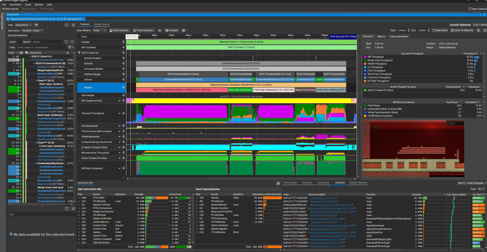

### GBuffer prototype using AI (April 5 2026)
Yesterday and this morning, I used Claude AI (shame on me?) in order to create a POC using deferred rendering, and I must admit that I have been stunned.

I (we?) managed to create a prototype in less than 3 hours. I already has implemented MRT, and all that was required in order to use deferred rendering but.. I could not imagine the AI to insert in my code so easilly.

As a result, I decided to give up on this way of rendering, because it does not worth the cost (performance are worst, with 7 lights and the same geometry condition the engine drops from ~1200 FPS to ~500 FPS).

Even if I want to learn in this project, intentionnaly making over engineering sometimes, I think it does not forth the effort here.

Here is a capture of timing measured in PIX:

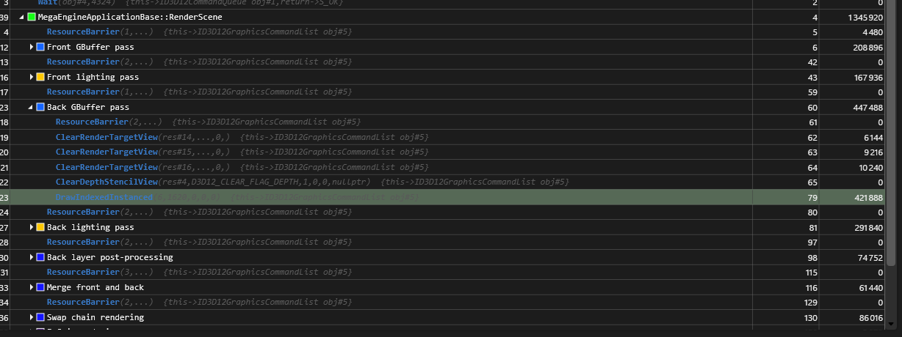

I'm not very confortable with AI, but I admit this is a very powerfull tool.

I'm going to keep the prototype in POC/LightningGBuffer branch

### Version 0.33 (April 4th 2026)
Restored multi pass rendering to apply full screen post processing effect on the parallax only.

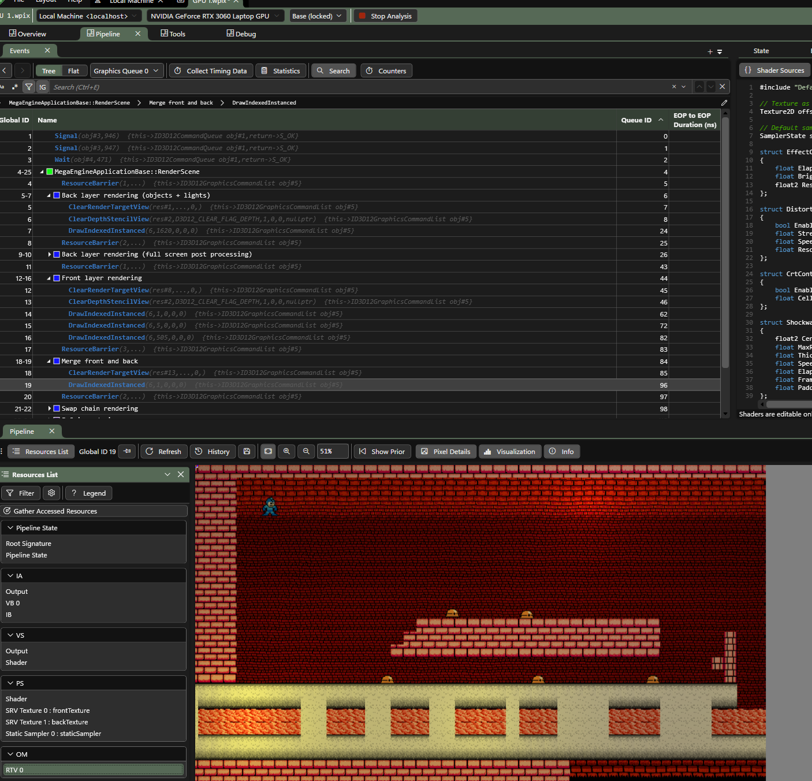

### Version 0.32 (April 3rd 2026)
Second step in data driven approach for this project. In this version, we load assets, lights, foreground and parallax from configuration files, dynamically creating templates in order to instanciate array of objects.

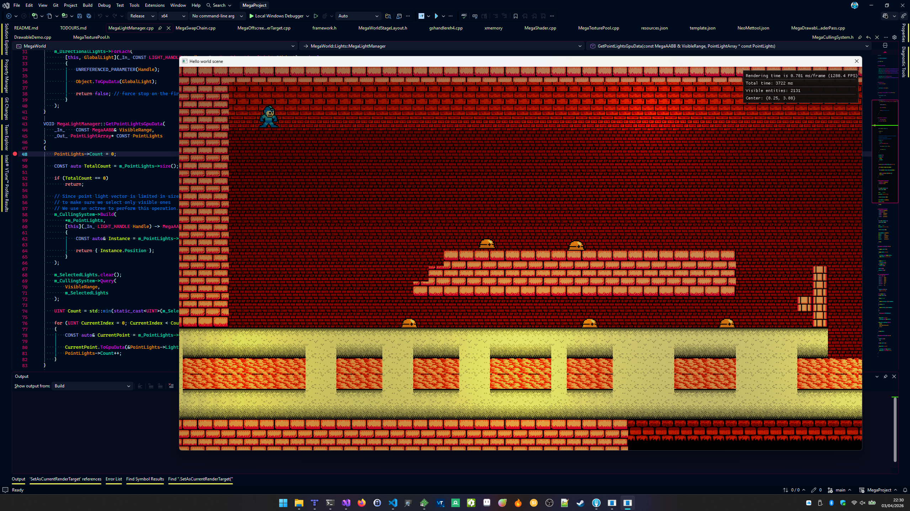

I noticed that shader performance is not great when using 16 lights. This is expected since we perform (16 * n) operations to compute light data where n is pixel count.

I discovered that my approach is named "forward rendering". In a near future, I will implement "deferred rendering".

### Version 0.31 (March 29 2026)
First step in data driven approach for this project. This version is coming with A LOT of improvement and features. Most noticeable things:

* New thread pool implementation, handling task dependencies and work stealing. The class is designed in order to reduce context switch, waiting using a spin lock, and reusing threads in order to process jobs as fast as possible
* Sparse set and handle generators in order to iterate over objects using cache friendly structures
* New NTree implementation, using a more c++ stylish implementation to build/query the tree
* A tool now converts asesprite data into custom json configuration files in order to declare textures, frame data and animations
    * Tiled is still used in order to describe the level layout
    * AseSprite files hilds texture data, animation data and collision boxes

All classes are now using data driven approach in MegaEngine. In this version, almost all Megaworld has been ported (physics engine is remaining)

I will not summarize all I've done during nearly four months... but the project is on the road.

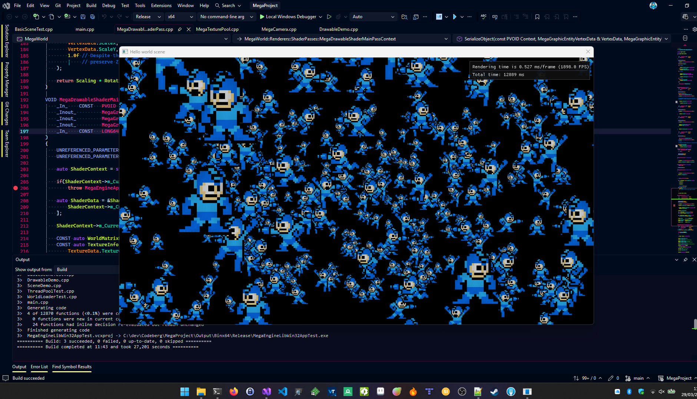

### Version 0.30 (January 6 2026)

Work and personal life has not been easy in 2025, so the project has been suspended until January 2026.

During the pause, I had the opportunity to learn things related to [data driven design](https://github.com/dbartolini/data-oriented-design) applied to game engine.

The experience on my engine showed that object oriented design has flaws, and I was struggling to add new functionnalities in a small amount of time while keeping a good balance with performances.

I decided to rework the whole project, applying data oriented design as much as possible.

I could check that this is a win-win solution (only on a small subset of functionnalities, like quadtrees and graphic objects), but I do not know whether I will have what it get to redesign the whole solution...

### Version 0.25 to 0.29 (January 15 to March 15, 2025)

Working on a new way to handle rendering pipeline:

- Implements render graph
- Implements global illumination
- Implements point light
- Implements new version of the rendering pipeline

### Version 0.24 (January 11, 2025)

I wanted to work on shader this month. I looked for the way I could use in order to create and debug them in a fast manner.

I'm using the combo Visual Studio Code + [Shadered](https://shadered.org/) in order to do it!

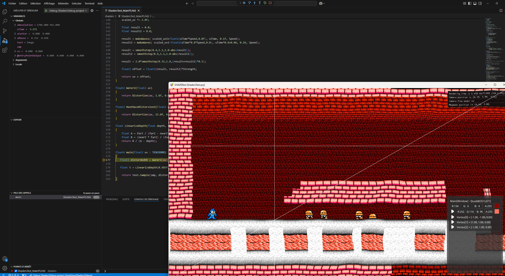

In this version, I also split the rendering phases in order to be able to apply full screen post processing on back layer only.

Next destination: create a simple render graph in order to optimize resource barrier...

### Version 0.23 (December 29, 2024)

I had to admit that creating my own level editor was a project in the project, even when using my engine to do it :pensive:

So I decided to look for a tool that I could use in order to help me creating my levels.

I found [this](http://www.mapeditor.org): 

This tool is very powerful, and has been used to create some well known games.

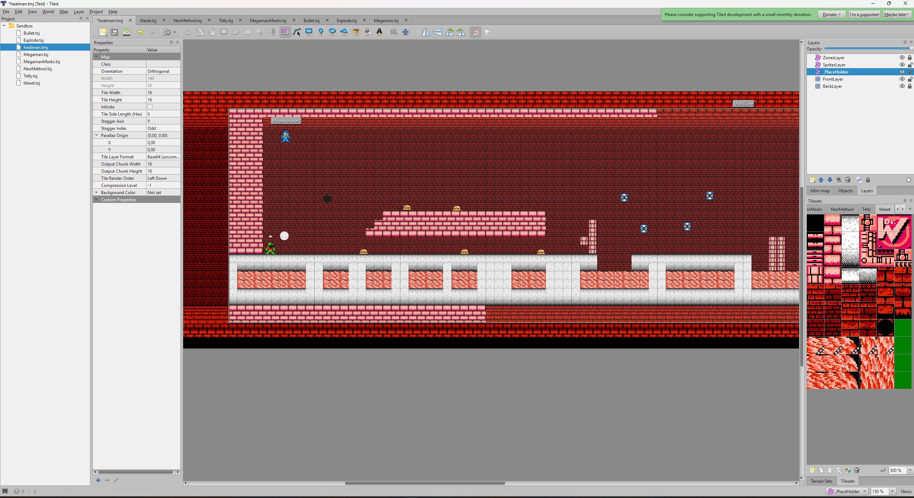

I use this library in order to parse configuration file: https://github.com/SSBMTonberry/tileson

I updated my code in order to transform object to my engine instance, and 

Last but not the least: I improve/fixed issues related to the code of the scene manager.

I also add the main scene of the engine: the stage scene allowing me to show what I designed in tiled.

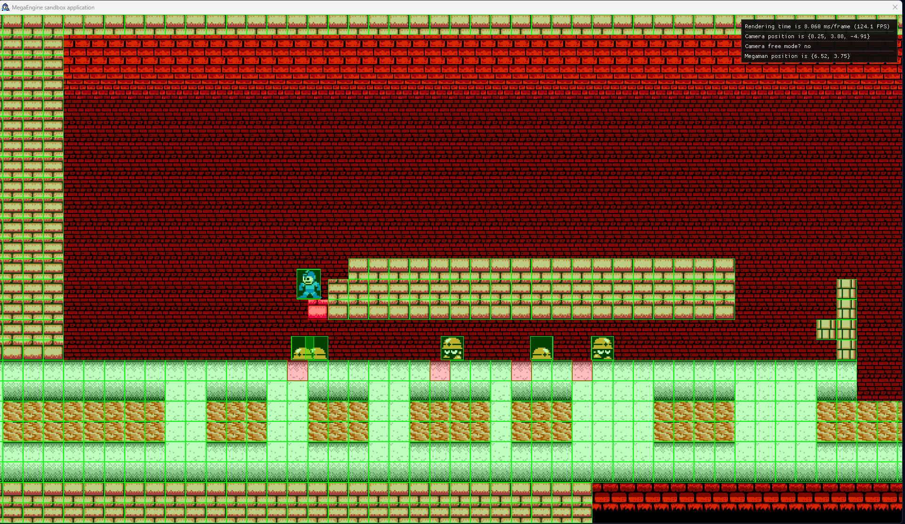

### Version 0.22 (November 28, 2024)

While working and thinking about the level editor, I decided to implement a scene manager in the engine.

Each scene is responsible on handling their resources, and a scene manager is able to switch from one scene to another!

This version comes with a built-in default scene manager, allowing us to load asynchronously a scene and apply it, using post processing effect like fading.

It also comes with a basic loading scene, and a sandbox scene.

### Version 0.21 (November 9, 2024)

These versions contain a lot bug fixes and improvements in the engine.

In this version I mainly update the engine in order to be able to perform parallel operations including:
- Parallel building of the command lists
- Parallel micro operation in the UpdateScene method

I won a little bit performance on the CPU side thanks to that, but I'm limited because of the way the shader buffer are handled.

I have ideas on how I will have to improve it, but it will have to wait because I'm working on the level editor right now, with a lot of improvements in the base engine...

### Version 0.18 to 0.20 (October 02 to 08, 2024)

These versions contain various bug fixes (related to Megaman hitbox) as well as improvements.

Version 0.19 comes with a proof of concept for a new feature that allows changing the level layout at runtime.

Please refer to the video referenced at the beginning of this document to see the new feature in action.

### Version 0.17 (September 27, 2024)

I just bought the [AseSprite](https://www.aseprite.org/) software to deal with the sprites. Using it, I added a new enemy in the scene, it will help a lot in the future!

Also fixed a lot of bugs related to the physics engine.

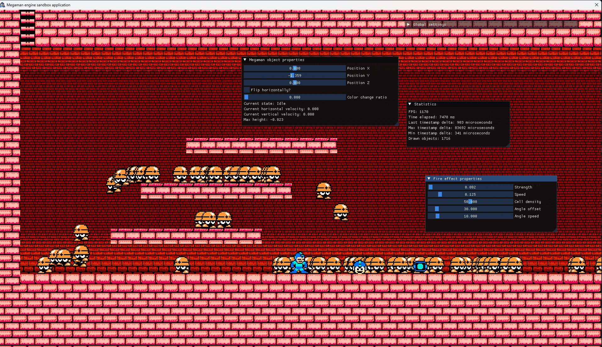

### Version 0.16 (September 24, 2024)

- We now perform the culling using the main scene quadtree object
- We can now dynamically add objects to the scene (in the limit of SRV buffer slots available :D)
- The engine now perform batch rendering of objects sharing the same geometry
    - Take a look [here (in french...)](Notes/BatchRendering.md) for more information about the way I refactored the code
- Restored wireframe rendering
- Restored the back layer rendering
- Restored MegaSpriteEx rendering using the new batch rendering system
- Restored collision box rendering
- Bug fixes + add PIX events to profile the application
- Implement a basic haze post processing effect 

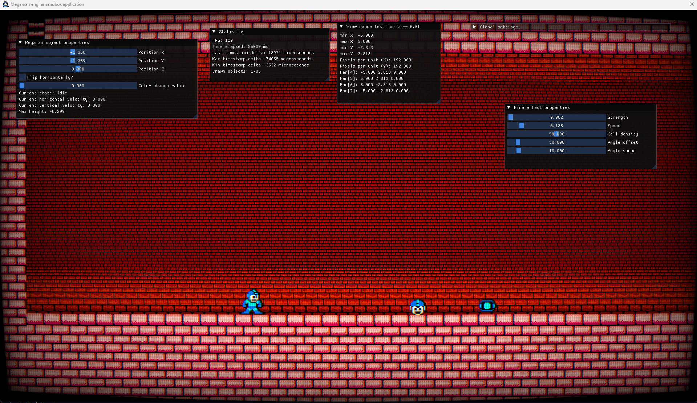

### Version 0.15 (September 08, 2024)

Finished the implementation of collision detection!!!

Before this version, collision with the floor was static (it is located at a fixed position in the scene). Now, the floor is a dynamic object, and the collision detection system is able to handle it.

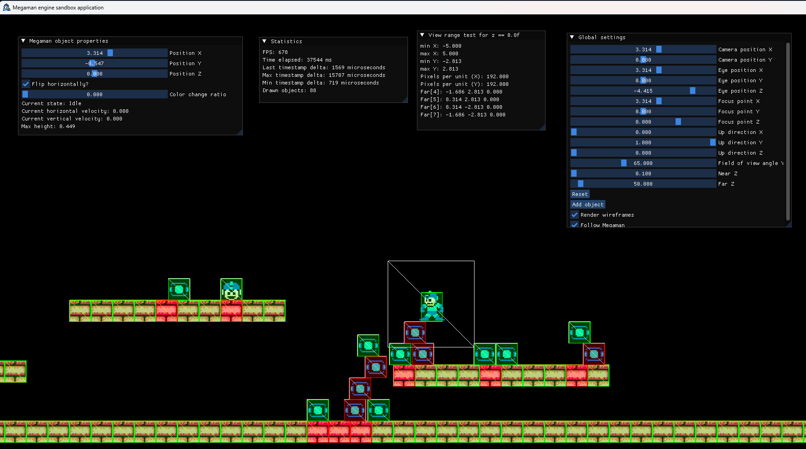<br>
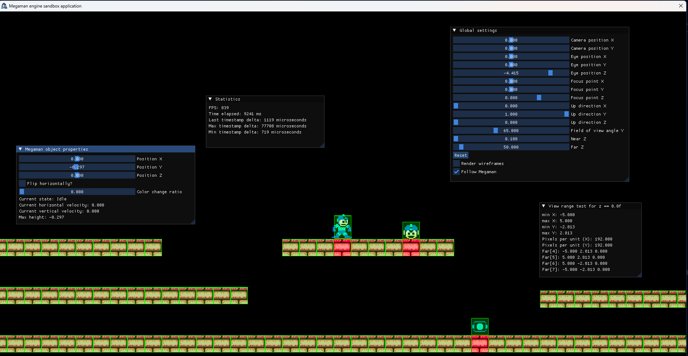

### Version 0.14 (August 31, 2024)

We can now render the collision boxes of the objects in the scene (in the previous version, the wireframe rendering stage was used as a trick!)

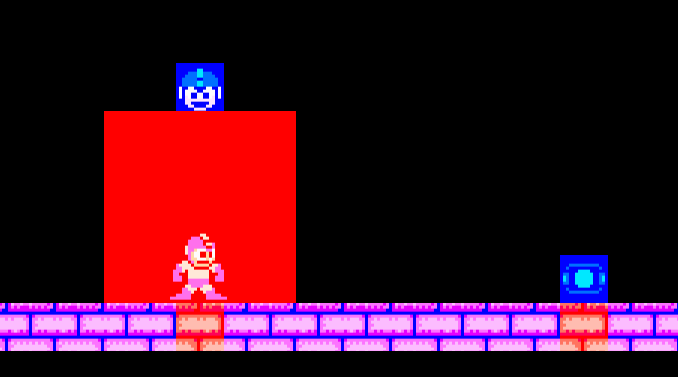

### Version 0.13 (August 17, 2024)

Very first demo code of the collision checking system. The system is based on the Minkowski sum concept. I it not yet fully functionnal at this point.

Also in this version, huge rework of the code to prepare the collision system, and the batch rendering system.

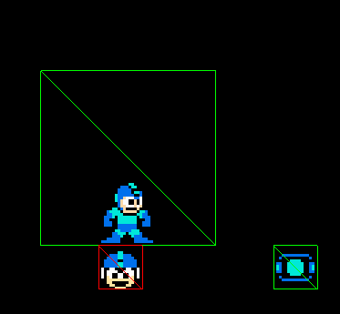

### Version 0.12 (February 16, 2024)

Create a dedicated static library to embed the engine code. Code rework to make it reusable and easier to maintain.

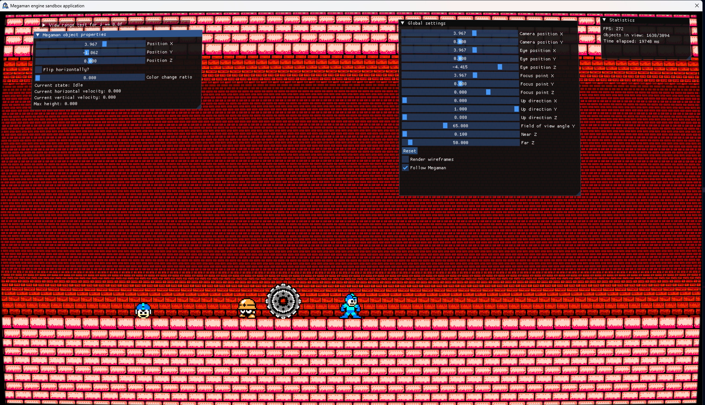

### Version 0.11 (January 28, 2024)

Spent a lot of time playing with shaders, and post processing effects.

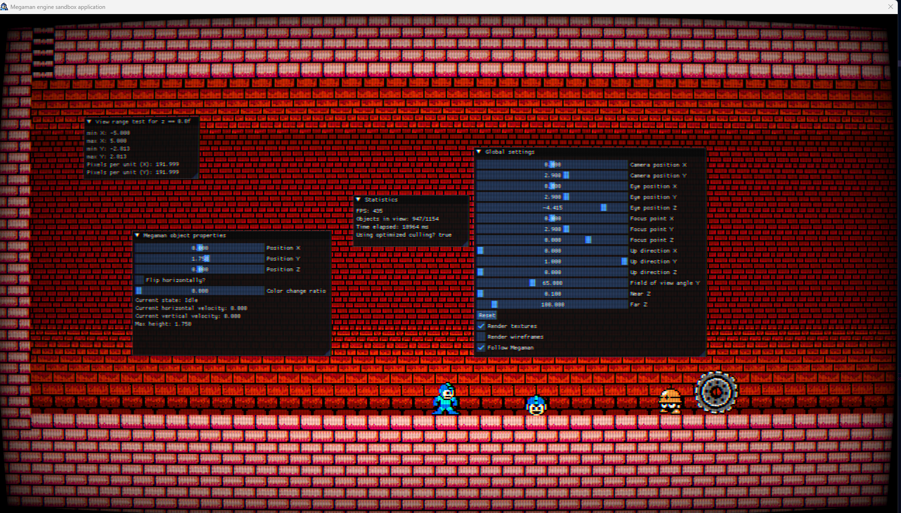
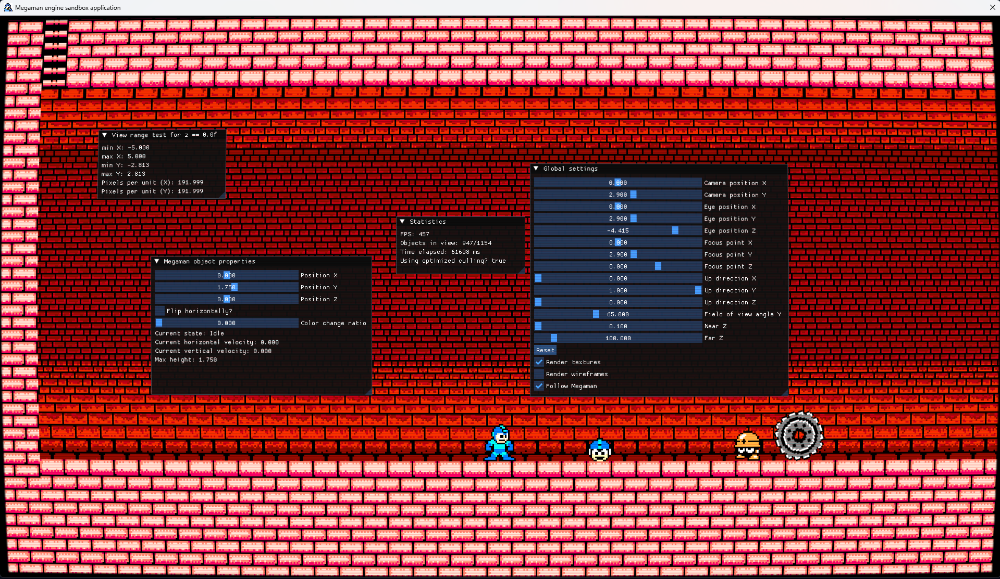

### Version 0.8 to 0.10 (January 13 to 24, 2024)

The engine is now able to handle post processing effects.

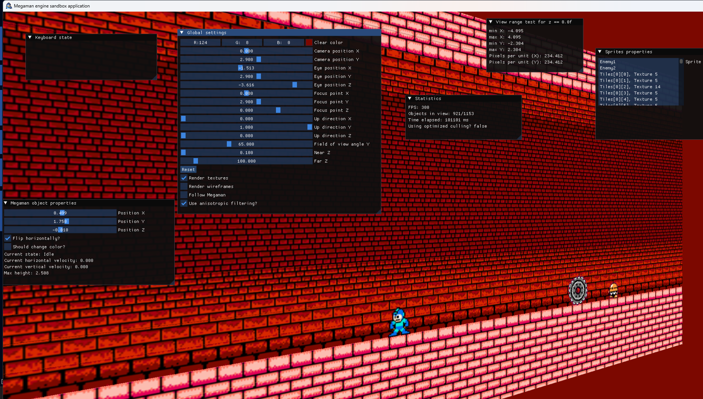

### Version 0.7 (January 04, 2024)

Making the main sprite movement uniform whatever the frame rate.

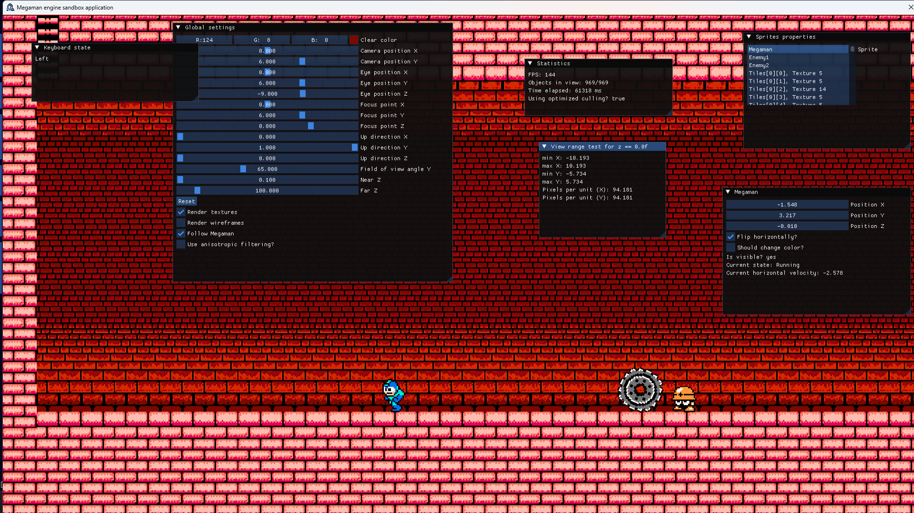

### Version 0.6 (December 28, 2023)

Improved scene presentation.

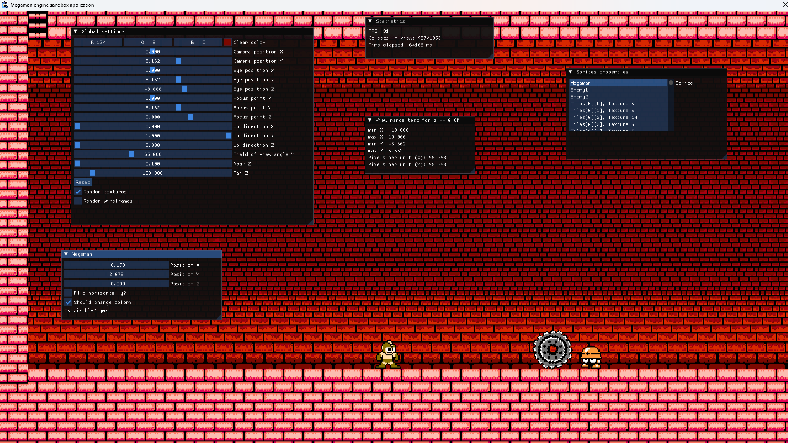

### Version 0.5 (December 22, 2023)

View fustrum culling using the camera object.

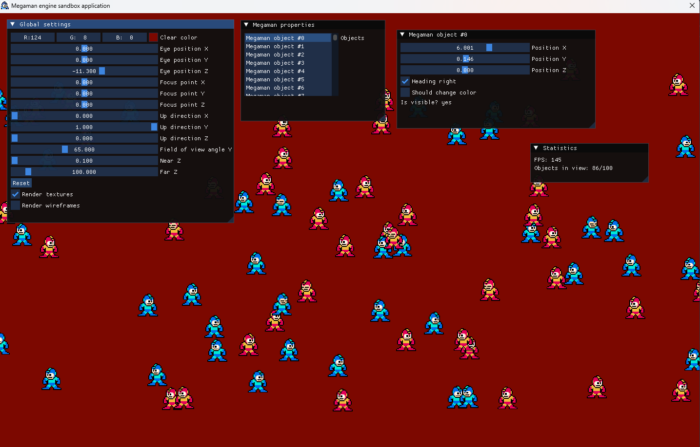

### Version 0.4 (December 20, 2023)

Various bug fixes and improvements. Trying to work on the game engine architecture.

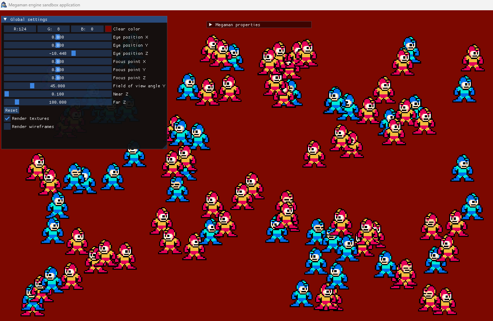

### Version 0.3 (December 08, 2023)

Minimal game application class.

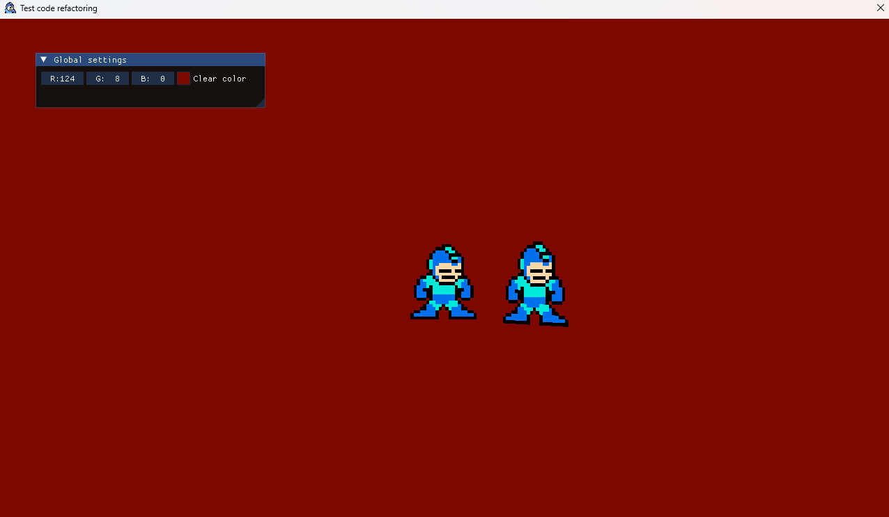

### Version 0.1 (November 11, 2023)

Create base engine structure and DirectX 12 layer library for our game engine.

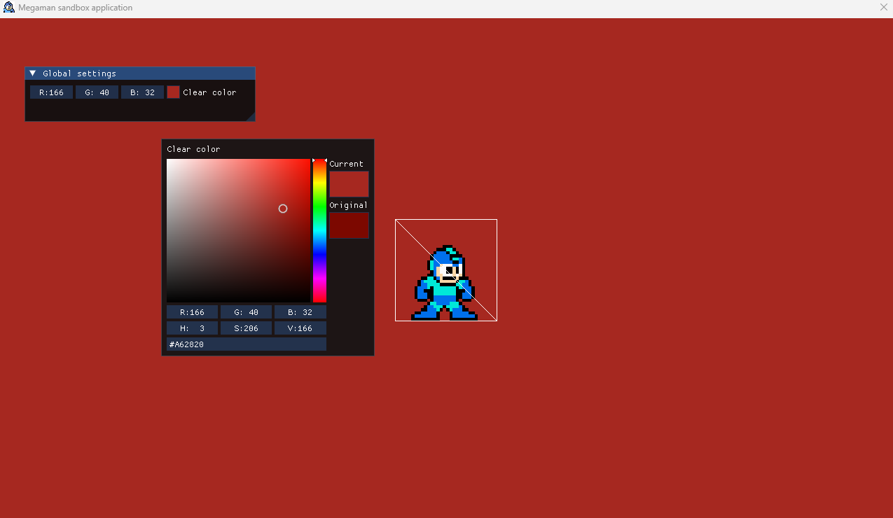

## Useful resources

### DirectX 12

<https://learn.microsoft.com/en-us/windows/win32/direct3d12/directx-12-programming-guide><br><br>
<https://learn.microsoft.com/en-us/windows/win32/direct3d11/d3d10-graphics-programming-guide-primitive-topologies#basic-primitive-types><br><br>
<https://learn.microsoft.com/en-us/windows/win32/direct3d12/using-constants-directly-in-the-root-signature><br><br>
<https://github.com/microsoft/DirectXTK12/wiki/CommonStates><br><br>

### Debug & Profiling

<https://devblogs.microsoft.com/pix/><br><br>

### Shaders

<https://thebookofshaders.com/glossary/?search=smoothstep><br><br>
<https://learn.microsoft.com/en-us/windows/win32/direct3dhlsl/dx-graphics-hlsl-smoothstep><br><br>
<https://mini.gmshaders.com/p/gm-shaders-mini-crt><br><br>
<https://gamedevbill.com/heat-haze-shader-graph/><br><br>
<https://jorenjoestar.github.io/post/pixel_art_filtering/><br><br>
<https://csantosbh.wordpress.com/2014/01/25/manual-texture-filtering-for-pixelated-games-in-webgl/><br><br>
<https://csantosbh.wordpress.com/2014/02/05/automatically-detecting-the-texture-filter-threshold-for-pixelated-magnifications/><br><br>
<https://colececil.io/blog/2017/scaling-pixel-art-without-destroying-it/><br><br>


### Camera

<https://www.scratchapixel.com/lessons/3d-basic-rendering/perspective-and-orthographic-projection-matrix/building-basic-perspective-projection-matrix.html><br><br>
<https://learn.microsoft.com/en-us/windows/win32/direct3d10/d3d10-graphics-programming-guide-resources-coordinates><br><br>
<https://docs.unity3d.com/Manual/FrustumSizeAtDistance.html><br><br>

### Megaman physics NES game information

<https://tasvideos.org/GameResources/NES/Rockman/Data><br><br>